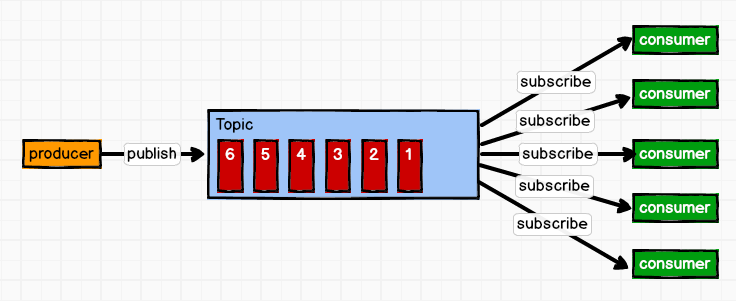
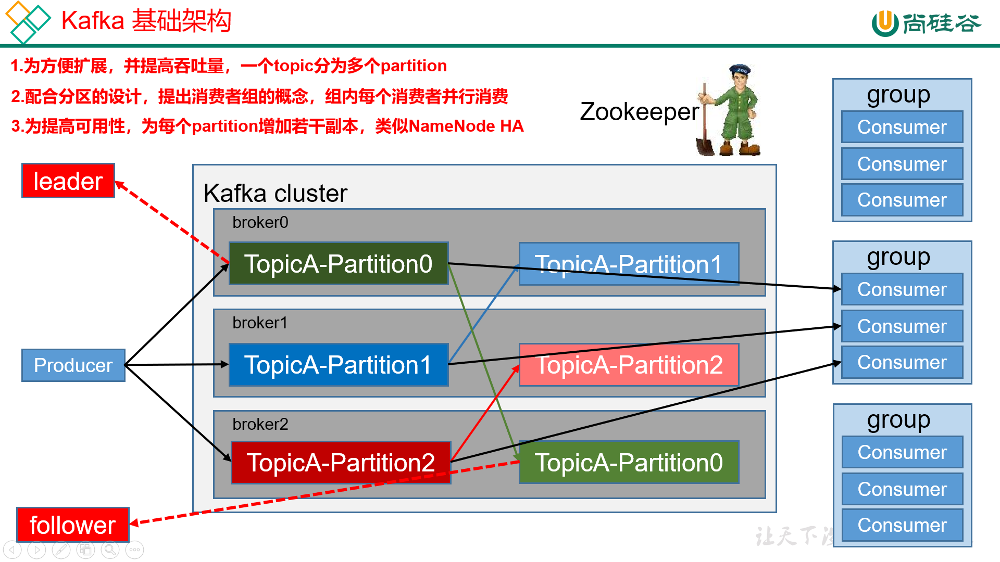

# Kafka的基础架构

## 一. Kafka概述

### 1.1 定义

Kafka是一个分布式的基于发布/订阅模式的**消息队列，**主要应用于大数据实时处理领域。

### 1.2 消息队列消息队列的两种模式

#### (1) 点对点模式

消息生产者生产消息发送到Queue中，然后消息消费者从Queue中取出并且消费消息。

消息被消费以后，queue中不再有存储，所以消息消费者不可能消费到已经被消费的消息。Queue支持存在多个消费者，但是对一个消息而言，只会有一个消费者可以消费。

#### (2) 发布/订阅模式（一对多，消费者消费数据之后不会清除消息）

消息生产者（发布）将消息发布到topic中，同时有多个消息消费者（订阅）消费该消息。和点对点方式不同，发布到topic的消息会被所有订阅者消费。

## 二. Kafka的基本架构

- **Producer ：**消息生产者，就是向kafka broker发消息的客户端；
- **Consumer** **：**消息消费者，向kafka broker取消息的客户端；
- **Consumer Group （CG）**：消费者组，由多个consumer组成。**消费者组内每个消费者负责消费不同分区的数据，一个分区只能由一个消费者消费；消费者组之间互不影响。**所有的消费者都属于某个消费者组，即**消费者组是逻辑上的一个订阅者**。
- **Broker** **：**一台kafka服务器就是一个broker。一个集群由多个broker组成。一个broker可以容纳多个topic。
- **Topic** **：**可以理解为一个队列，**生产者和消费者面向的都是一个topic**；
- **Partition：**为了实现扩展性，一个非常大的topic可以分布到多个broker（即服务器）上，**一个topic可以分为多个partition**，每个partition是一个有序的队列；
- **Replica**：副本，为保证集群中的某个节点发生故障时，**该节点上的partition数据不丢失，且kafka仍然能够继续工作**，kafka提供了副本机制，一个topic的每个分区都有若干个副本，一个**leader**和若干个**follower**。
- **Leader**：每个分区多个副本的“主”，生产者发送数据的对象，以及消费者消费数据的对象都是leader。
- **Follower**：每个分区多个副本中的“从”，实时从leader中同步数据，保持和leader数据的同步。leader发生故障时，某个follower会成为新的follower。