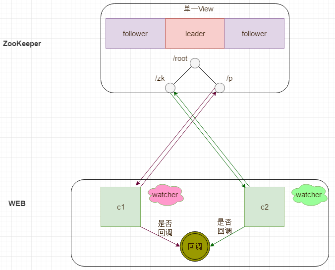

# Zookeeper的Watcher机制

> 本文转载至：<https://www.cnblogs.com/shamo89/p/9787176.html>

zookeeper主要是为了统一分布式系统中各个节点的工作状态，在资源冲突的情况下协调提供节点资源抢占，提供给每个节点了解整个集群所处状态的途径。这一切的实现都依赖于zookeeper中的事件监听和通知机制。

## 一. Zookeeper中的事件和状态

事件和状态构成了zookeeper客户端连接描述的两个维度。注意，网上很多帖子都是在介绍zookeeper客户端连接的事件，但是忽略了zookeeper客户端状态的变化也是要进行监听和通知的。这里我们通过下面的两个表详细介绍zookeeper中的事件和状态（zookeeper API中被定义为@Deprecated的事件和状态就不介绍了）。

### 1.1 Zookeeper客户端与Zookeeper server连接的状态

| 连接状态                  | 状态含义                                                     |
| ------------------------- | ------------------------------------------------------------ |
| KeeperState.Expired       | 客户端和服务器在ticktime的时间周期内，是要发送心跳通知的。这是租约协议的一个实现。客户端发送request，告诉服务器其上一个租约时间，服务器收到这个请求后，告诉客户端其下一个租约时间是哪个时间点。当客户端时间戳达到最后一个租约时间，而没有收到服务器发来的任何新租约时间，即认为自己下线（此后客户端会废弃这次连接，并试图重新建立连接）。这个过期状态就是Expired状态 |
| KeeperState.Disconnected  | 就像上面那个状态所述，当客户端断开一个连接（可能是租约期满，也可能是客户端主动断开）这是客户端和服务器的连接就是Disconnected状态 |
| KeeperState.SyncConnected | 一旦客户端和服务器的某一个节点建立连接（注意，虽然集群有多个节点，但是客户端一次连接到一个节点就行了），并完成一次version、zxid的同步，这时的客户端和服务器的连接状态就是SyncConnected |
| KeeperState.AuthFailed    | zookeeper客户端进行连接认证失败时，发生该状态                |

需要说明的是，这些状态在触发时，所记录的事件类型都是：EventType.None。

### 1.2 Zookeeper中的watch事件

| zookeeper事件                 | 事件含义                                                     |
| ----------------------------- | ------------------------------------------------------------ |
| EventType.NodeCreated         | 当node-x这个节点被创建时，该事件被触发                       |
| EventType.NodeChildrenChanged | 当node-x这个节点的直接子节点被创建、被删除、子节点数据发生变更时，该事件被触发。 |
| EventType.NodeDataChanged     | 当node-x这个节点的数据发生变更时，该事件被触发               |
| EventType.NodeDeleted         | 当node-x这个节点被删除时，该事件被触发。                     |
| EventType.None                | 当zookeeper客户端的连接状态发生变更时，即KeeperState.Expired、KeeperState.Disconnected、KeeperState.SyncConnected、KeeperState.AuthFailed状态切换时，描述的事件类型为EventType.None |


## 二. watch机制

Znode发生变化（Znode本身的增加，删除，修改，以及子Znode的变化）可以通过Watch机制通知到客户端。那么要实现Watch，就必须实现org.apache.zookeeper.Watcher接口，并且将实现类的对象传入到可以Watch的方法中。Zookeeper中所有读操作（getData()，getChildren()，exists()）都可以设置Watch选项。Watch事件具有one-time trigger（一次性触发）的特性，如果Watch监视的Znode有变化，那么就会通知设置该Watch的客户端。

在上述说道的所有读操作中，**如果需要Watcher，我们可以自定义Watcher，如果是boolean型变量，当为true时，则使用系统默认的Watcher，系统默认的Watcher是在Zookeeper的构造函数中定义的Watcher。参数中Watcher为空或者false，表示不启用Wather**。

### 2.1 watch特性1：一次性触发器

客户端在Znode设置了Watch时，如果Znode内容发生改变，那么客户端就会获得Watch事件。例如：客户端设置getData("/znode1", true)后，如果/znode1发生改变或者删除，那么客户端就会得到一个/znode1的Watch事件，但是/znode1再次发生变化，那客户端是无法收到Watch事件的，除非客户端设置了新的Watch。

### 2.2 watch特性2：发送至客户端

Watch事件是异步发送到Client，Zookeeper可以保证客户端发送过去的更新顺序是有序的。例如：某个Znode没有设置watcher，那么客户端对这个Znode设置Watcher发送到集群之前，该客户端是感知不到该Znode任何的改变情况的。

换个角度来解释：由于Watch有一次性触发的特点，所以在服务器端没有Watcher的情况下，Znode的任何变更就不会通知到客户端。不过，即使某个Znode设置了Watcher，且在Znode有变化的情况下通知到了客户端，但是在客户端接收到这个变化事件，但是还没有再次设置Watcher之前，如果其他客户端对该Znode做了修改，这种情况下，Znode第二次的变化客户端是无法收到通知的。这可能是由于网络延迟或者是其他因素导致，所以我们使用**Zookeeper不能期望能够监控到节点每次的变化。Zookeeper只能保证最终的一致性，而无法保证强一致性**。

### 2.3 watch特性3：设置watch的数据内容

Znode改变有很多种方式，例如：节点创建，节点删除，节点改变，子节点改变等等。Zookeeper维护了两个Watch列表，一个节点数据Watch列表，另一个是子节点Watch列表。

`getData()`和`exists()`方法可以为当前节点设置`数据Watch`，`getChildren()`可以设置设置`子节点Watch`。两者选其一，可以让我们根据不同的返回结果选择不同的Watch方式。当我们调用节点操作方法时会触发相应的`Watch`事件：

- setData()：触发当前节点的内容Watch。
- create()：触发当前节点的内容Watch以及其父节点的子节点Watch。
- delete()：触发当前节点的内容Watch以及其父节点的子节点Watch。

## 三. Zookeeper Watcher的运行机制

1. Watch是轻量级的，其实就是本地JVM的Callback，服务器端只是存了是否有设置了Watcher的布尔类型。（源码见：org.apache.zookeeper.server.FinalRequestProcessor）
2. 在服务端，在FinalRequestProcessor处理对应的Znode操作时，会根据客户端传递的watcher变量，添加到对应的ZKDatabase（org.apache.zookeeper.server.ZKDatabase）中进行持久化存储，同时将自己NIOServerCnxn做为一个Watcher callback，监听服务端事件变化
3. Leader通过投票通过了某次Znode变化的请求后，然后通知对应的Follower，Follower根据自己内存中的zkDataBase信息，发送notification信息给zookeeper客户端。
4. Zookeeper客户端接收到notification信息后，找到对应变化path的watcher列表，挨个进行触发回调。



## 四. 案例

### 4.1 一个节点上可以绑定多个Watcher：

```java
    @Test
    public void testWatcher() throws KeeperException, InterruptedException {
        CountDownLatch countDownLatch = new CountDownLatch(1);
        ZooKeeper zooKeeper = null;
        try {
            zooKeeper = new ZooKeeper("192.168.0.11:2181", 5000, new Watcher() {
                @Override
                public void process(WatchedEvent watchedEvent) {
                    if (watchedEvent.getType() == Event.EventType.None && watchedEvent.getState() == Event.KeeperState.SyncConnected) {
                        countDownLatch.countDown();
                    } else {
                        System.out.println("触发事件1：" + watchedEvent.getPath());
                    }
                }
            }, true);
            countDownLatch.await();
        } catch (Exception e) {
            e.printStackTrace();
        } 
        System.out.println("连接成功");
        zooKeeper.getData("/watcher_envent/test1", true, null);
        zooKeeper.getData("/watcher_envent/test1", event -> {
            System.out.println("触发事件2：" + event.getPath());
        }, null);
        zooKeeper.getData("/watcher_envent/test1", event -> {
            System.out.println("触发事件3：" + event.getPath());
        }, null);
        zooKeeper.setData("/watcher_envent/test1", "s".getBytes(), -1);
    }

```


### 4.2 触发器是一次性的

```java
    @Test
    public void testWatcher() throws KeeperException, InterruptedException {
        CountDownLatch countDownLatch = new CountDownLatch(1);
        ZooKeeper zooKeeper = null;
        try {
            zooKeeper = new ZooKeeper("192.168.0.11:2181", 5000, new Watcher() {
                @Override
                public void process(WatchedEvent watchedEvent) {
                    if (watchedEvent.getType() == Event.EventType.None && watchedEvent.getState() == Event.KeeperState.SyncConnected) {
                        countDownLatch.countDown();
                    } else {
                        System.out.println("触发事件1：" + watchedEvent.getPath());
                    }
                }
            }, true);
            countDownLatch.await();
        } catch (Exception e) {
            e.printStackTrace();
        } 
        System.out.println("连接成功");
        zooKeeper.getData("/watcher_envent/test1", true, null);
        zooKeeper.setData("/watcher_envent/test1", "s".getBytes(), -1);
        zooKeeper.setData("/watcher_envent/test1", "ss".getBytes(), -1);
    }
```


### 4.3 setData()只能触发当前节点`数据watch`，不能触发父节点的`子节点watch`

```java
    @Test
    public void testWatcher() throws KeeperException, InterruptedException {
        CountDownLatch countDownLatch = new CountDownLatch(1);
        ZooKeeper zooKeeper = null;
        try {
            zooKeeper = new ZooKeeper("192.168.0.11:2181", 5000, new Watcher() {
                @Override
                public void process(WatchedEvent watchedEvent) {
                    if (watchedEvent.getType() == Event.EventType.None && watchedEvent.getState() == Event.KeeperState.SyncConnected) {
                        countDownLatch.countDown();
                    } else {
                        System.out.println("触发事件1：" + watchedEvent.getPath());
                    }
                }
            }, true);
            countDownLatch.await();
        } catch (Exception e) {
            e.printStackTrace();
        } 
        System.out.println("连接成功");
        zooKeeper.getChildren("/watcher_envent", event -> {
            System.out.println("子节点发生改变了："+event.getPath());
        });
        zooKeeper.getData("/watcher_envent/test1", event -> {
            System.out.println("节点值发生改变："+event.getPath());
        }, null);
        zooKeeper.setData("/watcher_envent/test1", "ss".getBytes(), -1);
    }
```


### 4.4 delete()既能触发当前节点`数据watch`，也能触发父节点的`子节点watch`

```java
    @Test
    public void testWatcher() throws KeeperException, InterruptedException {
        CountDownLatch countDownLatch = new CountDownLatch(1);
        ZooKeeper zooKeeper = null;
        try {
            zooKeeper = new ZooKeeper("192.168.0.11:2181", 5000, new Watcher() {
                @Override
                public void process(WatchedEvent watchedEvent) {
                    if (watchedEvent.getType() == Event.EventType.None && watchedEvent.getState() == Event.KeeperState.SyncConnected) {
                        countDownLatch.countDown();
                    } else {
                        System.out.println("触发事件1：" + watchedEvent.getPath());
                    }
                }
            }, true);
            countDownLatch.await();
        } catch (Exception e) {
            e.printStackTrace();
        } 
        System.out.println("连接成功");
        zooKeeper.getChildren("/watcher_envent", event -> {
            System.out.println("子节点发生改变了："+event.getPath());
        });
        zooKeeper.getData("/watcher_envent/test1", event -> {
            System.out.println("节点值发生改变："+event.getPath());
        }, null);
        zooKeeper.delete("/watcher_envent/test1",-1);
    }
```

