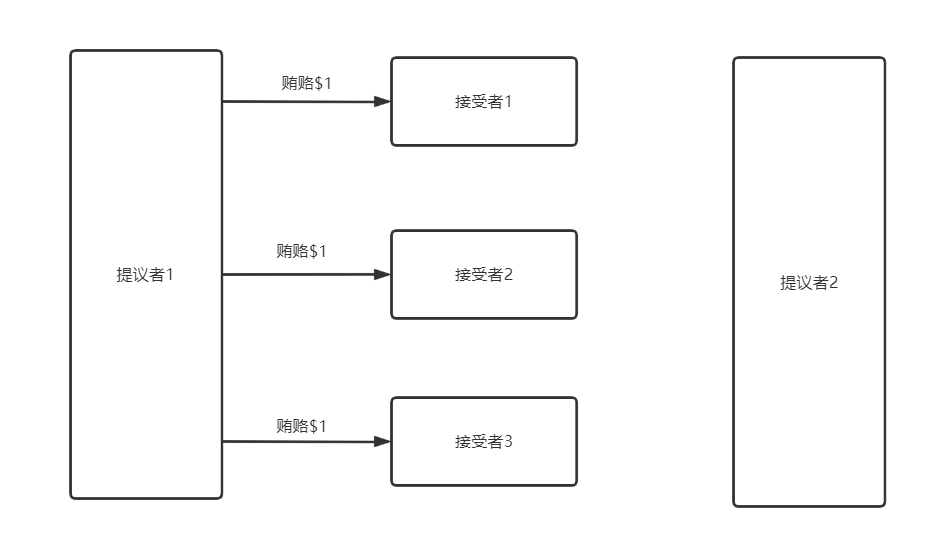
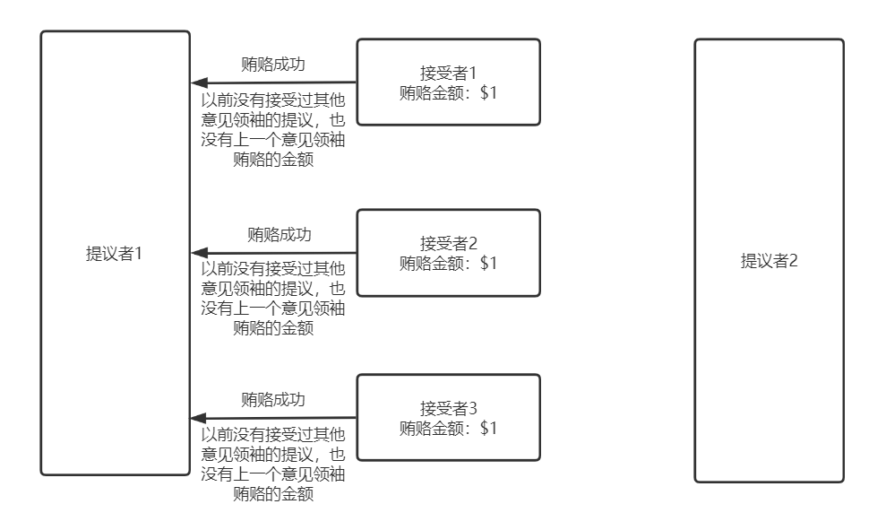
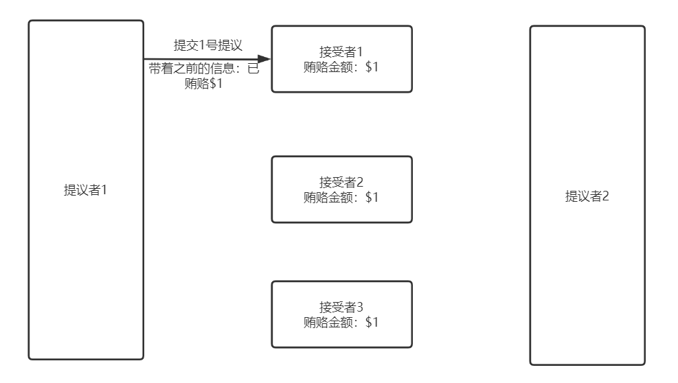
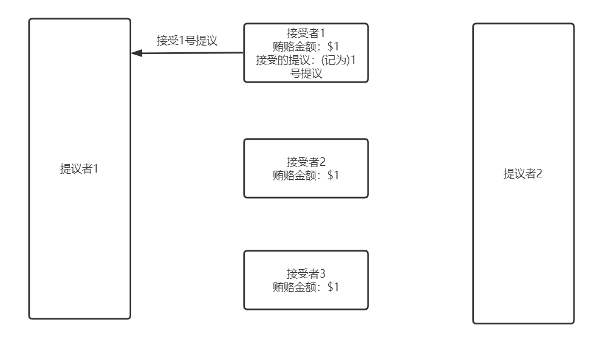
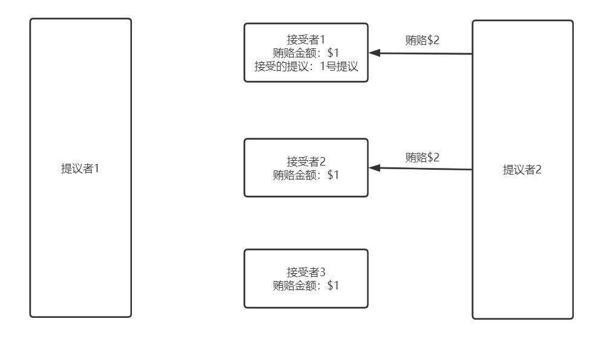
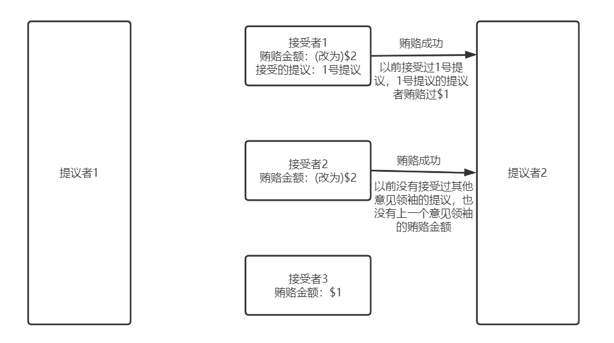
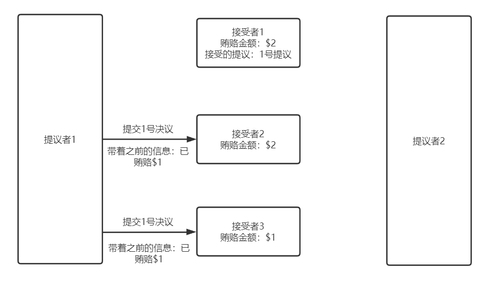
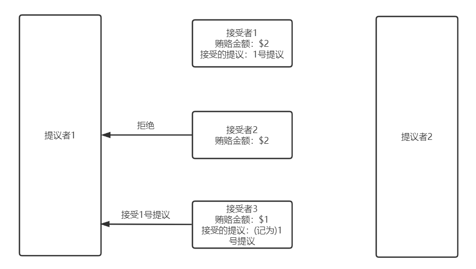
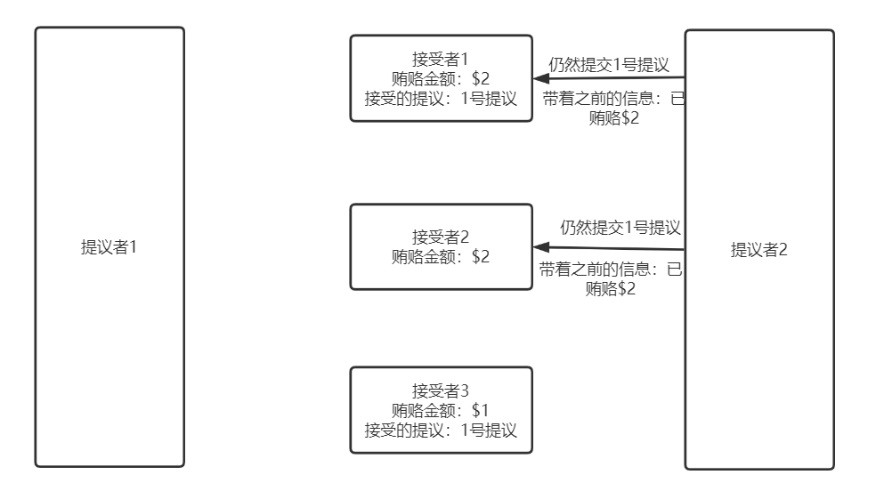
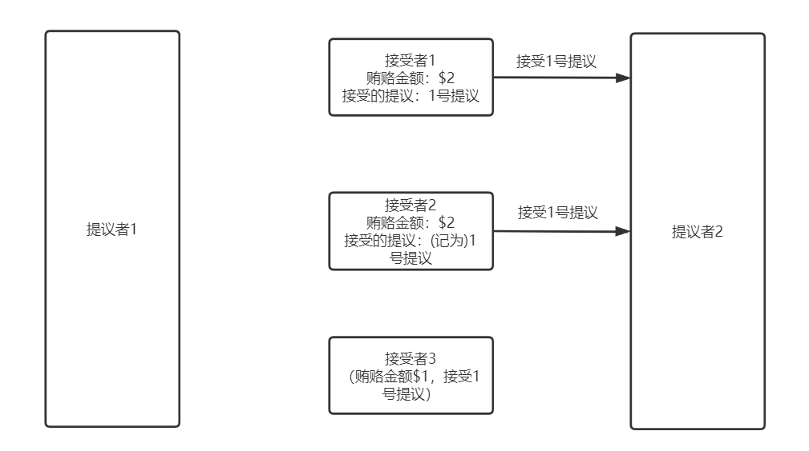

# Paxos算法

> 说明：本文转载至：<https://www.zhihu.com/question/19787937>

看了几篇前面的答案，感觉都是为了逻辑的验密性，进行了大篇幅的推理，这样确实非常严谨，但是理解起来就要废一番功夫了。我就不用一步一步的推理来描述了，这样虽然丧失一些严密性，但是会尽量提高可读性，争取让每个人都能理解这个算法的要点。 

`Paxos`算法是分布式技术大师`Lamport`提出的，主要目的是通过这个算法，让参与分布式处理的每个参与者逐步达成一致意见。用好理解的方式来说，就是在一个选举过程中，让不同的选民最终做出一致的决定。 

`Lamport`为了讲述这个算法，假想了一个叫做`Paxos`的希腊城邦进行选举的情景，这个算法也是因此而得名。在他的假想中，这个城邦要采用民主提议和投票的方式选出一个最终的决议，但由于城邦的居民没有人愿意把全部时间和精力放在这种事情上，所以他们只能不定时的来参加提议，不定时来了解提议、投票进展，不定时的表达自己的投票意见。`Paxos`算法的目标就是让他们按照少数服从多数的方式，最终达成一致意见。 

## Paxos算法的具体思路

在整个提议和投票过程中，主要的角色就是“提议者”和“接受者”：

- 提议者：向“接受者”提出提议。
- 接受者：收到“提议者”的提议后，向“提议者”表达自己的意见

### 整个算法的大致过程为：

- 第一阶段：因为存在多个“提议者”，如果都提意见，那么“接受者”接受谁的不接受谁的？太混乱了。所以，要先明确哪个“提议者”是意见领袖有权提出提议，未来，“接受者”们就主要处理这个“提议者”的提议了（这样，也可以在提出提议时就尽量让意见统一，谋求尽早形成多数派）。

- 第二阶段：由上阶段选出的意见领袖提出提议，“接受者”反馈意见。如果多数“接受者”接受了一个提议，那么提议就通过了。

### 必须要了解的其他相关背景：

1. 怎么明确意见领袖呢？通过编号。每个“提议者”在第一阶段先报个号，谁的号大，谁就是意见领袖。如果不好理解，可以想象为贿选。每个提议者先拿着钞票贿赂一圈“接受者”，谁给的钱多，第二阶段“接受者”就听谁的。（注：这里和下文提到的“意见领袖”，并不是一个新的角色，而是代表在那一轮贿赂成功的“提议者”。所以，请把意见领袖理解为贿赂中胜出的“提议者”即可）

2. 有个跟选举常识不一样的地方，就是每个“提议者”不会执着于让自己的提议通过，而是每个“提议者”会执着于让提议尽快达成一致意见。所以，为了这个目标，如果“提议者”在贿选的时候，发现“接受者”已经接受过前面意见领袖的提议了，即便“提议者”贿选成功，也会默默的把自己的提议改为前面意见领袖的提议。所以一旦贿赂成功，胜出的“提议者”再提出提议，提议内容也是前面意见领袖的提议（这样，在谋求尽早形成多数派的路上，又前进了一步）

3. 钱的多少很重要，如果钱少了，无论在第一还是第二阶段“接受者”都不会尿你，直接拒绝。

4. 上面2）中讲到，如果“提议者”在贿选时，发现前面已经有意见领袖的提议，那就将自己的提议默默改成前面意见领袖的提议。这里有一种情况，如果你是“提议者”，在贿赂的时候，“接受者1”跟你说“他见过的意见领袖的提议是方案1”，而“接受者2”跟你说“他见过的意见领袖提议是方案2”，你该怎么办？这时的原则也很简单，还是：钱的多少很重要！你判断一下是“接受者1”见过的意见领袖有钱，还是“接受者2”见过的意见领袖有钱？如何判断呢？因为“接受者”在被“提议者”贿赂的时候，自己会记下贿赂的金额。所以当你贿赂“接受者”时，一旦你给的贿赂多而胜出，“接受者”会告诉你两件事情：a.前任意见领袖的提议内容（如果有的话），b.前任意见领袖当时贿赂了多少钱。这样，再面对刚才的情景时，你只需要判断一下“接受者1”和“接受者2”告诉你的信息中，哪个意见领袖当时给的钱多，那你就默默的把自己的提议，改成那个意见领袖的提议。这时就形成了一种博弈：

5. 最后这一部分最有意思，但描述起来有点绕，如果不能一下子就理解可以先看后面的例子。在整个选举过程中，每个人谁先来谁后到，“接受者”什么时间能够接到“提议者”的信息，是完全不可控的。所以很可能一个意见领袖已经产生了，但是由于这个意见领袖的第二阶段刚刚开始，绝大部分“接受者”还没有收到这个意见领袖的提议。结果，这时突然冲进来了一个新的土豪“提议者”，那么这个土豪“提议者”也是有机会让自己的提议胜出的！

	- 上一个意见领袖要赶在土豪“提议者”贿赂到“接受者”前，赶到“接受者”面前让他接受自己的提议，否则会因为自己的之前贿赂的钱比土豪少而被拒绝。

	- 土豪“提议者”要赶在上一个意见领袖将提议传达给“接受者”前，贿赂到“接受者”，否则土豪“提议者”即便贿赂成功，也要默默的将自己的提议改为前任意见领袖的提议。这整个博弈的过程，最终就看这两个“提议者”谁的进展快了。但最终一定会有一个意见领袖，先得到多数“接受者”的认可，那他的提议就胜出了。

### 思路总结

好啦，故事到这里基本讲述完了，咱们来总结一下，其实Paxos算法就下面这么几个原则：

1. Paxos算法包括两个阶段：第一个阶段主要是贿选，还没有提出提议；第二个阶段主要根据第一阶段的结果，明确接受谁的提议，并明确提议的内容是什么（这个提议可能是贿选胜出“提议者”自己的提议，也可能是前任意见领袖的提议，具体是哪个提议，见下面第3点原则）。

2. 编号（贿赂金额）很重要，无论在哪个阶段，编号（贿赂金额）小的，都会被鄙视（被拒绝）。

3. 在第一阶段中，一旦“接受者”已经接受了之前意见领袖的提议，那后面再来找这个“接受者”的“提议者”，即便在贿赂中胜出，也要被洗脑，默默将自己的提议改为前任意见领袖的提议，然后他会在第二阶段提出该提议（也就是之前意见领袖的提议，以力争让大家的意见趋同）。如果“接受者”之前没有接受过任何提议，那贿选胜出的“提议者”就可以提出自己的提议了。

## 示例

有两个“提议者”和三个“接受者”。

1. 首先“提议者1”贿赂了3个“接受者”

 

2. 3个“接受者”记录下贿赂金额，因为目前只有一个“提议者”出价，因此`$1`就是最高的了，所以“接受者”们返回贿赂成功。此外，因为没有任何先前的意见领袖提出的提议，因此“接受者”们告诉“提议者1”没有之前接受过的提议（自然也就没有上一个意见领袖的贿赂金额了）。

3. “提议者1”向“接受者1”提出了自己的提议：1号提议，并告知自己之前已贿赂`$1`。

4. “接受者1”检查了一下，目前记录的贿赂金额就是`$1`，于是接受了这一提议，并把1号提议记录在案。

5. 在“提议者1”向“接受者2”“接受者3”发起提议前，土豪“提议者2”出现，他开始用`$2`贿赂“接受者1”与“接受者2”。

6. “接受者1”与“接受者2”立刻被收买，将贿赂金额改为`$2`。但是，不同的是：“接受者1”告诉“提议者2”,之前我已经接受过1号提议了，同时1号提议的“提议者”贿赂过`$1`；而，“接受者2”告诉“提议者2”，之前没有接受过其他意见领袖的提议，也没有上一个意见领袖的贿赂金额。

7. 这时，“提议者1”回过神来了，他向“接受者2”和“接受者3”发起1号提议，并带着信息“我前期已经贿赂过`$1`”。

8. “接受者2”“接受者3”开始答复：“接受者2”检查了一下自己记录的贿赂金额，然后表示，已经有人出价到`$2`了，而你之前只出到`$1`，不接受你的提议，再见。但“接受者3”检查了一下自己记录的贿赂金额，目前记录的贿赂金额就是`$1`，于是接受了这一提议，并把1号提议记录在案。

9. 到这里，“提议者1”已经得到两个接受者的赞同，已经得到了多数“接受者”的赞同。于是“提议者1”确定1号提议最终通过。

10. 下面，回到“提议者2”。刚才说到，“提议者2”贿赂了“接受者1”和“接受者2”，被“接受者1”告知：“之前已经接受过1号提议了，同时1号提议的‘提议者’贿赂过`$1`”，并被“接受者2”告知：“之前没有接到过其他意见领袖的提议，也没有其他意见领袖的贿赂金额”。这时“提议者2”，拿到信息后，判断一下，目前贿赂过最高金额（即​`$1`）的提议就是1号提议了，所以“提议者2”默默的把自己的提议改为与1号提议一致，然后开始向“接受者1”“接受者2”发起提议（提议内容仍然是1号提议），并带着信息：之前自己已贿赂过​`$2`。

11. 这时“接受者1”“接受者2”收到“提议者2”的提议后，照例先比对一下贿赂金额，比对发现“提议者2”之前已贿赂`$2`，并且自己记录的贿赂金额也是​`$2`，所以接受他的提议，也就是都接受1号提议。

12. 于是，“提议者2”也拿到了多数派的意见，最终通过的也是1号提议。

### 多说一句

回到上面的第5步，如果“提议者2”第一次先去贿赂“接受者2”“接受者3”会发生什么？那很可能1号提议就不会成为最终选出的提议。因为当“提议者2”先贿赂到了“接受者2”“接受者3”，那等“提议者1”带着议题再去找这两位的时候，就会因为之前贿赂的钱少（`$1`<​`$2`）而被拒绝。所以，这也就是刚才讲到可能存在博弈的地方：

1. “提议者1”要赶在“提议者2”贿赂到“接受者2”“接受者3”之前，让“接受者2”“接受者3”接受自己的意见，否则“提议者1”会因为钱少而被拒绝；

2. “提议者2”要赶在“提议者1”之前贿赂到“接受者”，否则“提议者2”即便贿赂成功，也要默默的将自己的提议改为“提议者1”的提议。但你往后推演会发现，无论如何，总会有一个“提议者”的提议获得多数票而胜出。

以上，只是把大致的Paxos算法的思路介绍了一下，因为情景实在太复杂，比如：“提议者”、“接受者”如果是4个、5个……，比如：“提议者”与“接受者”之间的交互谁先谁后，等等各类情况。但是，其实都是能够严谨的推导出最后能够选出一个多数派的，不过篇幅就会太长了。大家有兴趣可以按照上面的思路，自己再模拟模拟“提议者”“接受者”数量或多或少，交互或先或后的各种情况，结果肯定是最终唯一一个提议会获得多数票而胜出。

回想当时自己看Paxos算法时，走过很多的弯路，花了很长时间，这篇文章也是结合自己看Paxos算法时的一些心得所写，希望对初学者能有些启发。