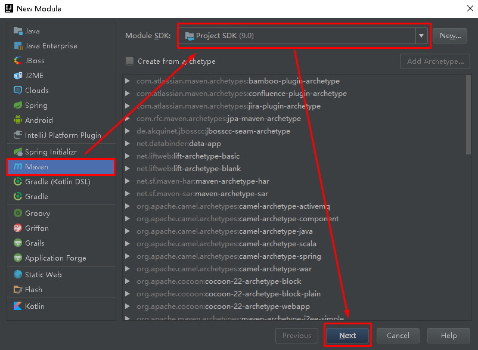
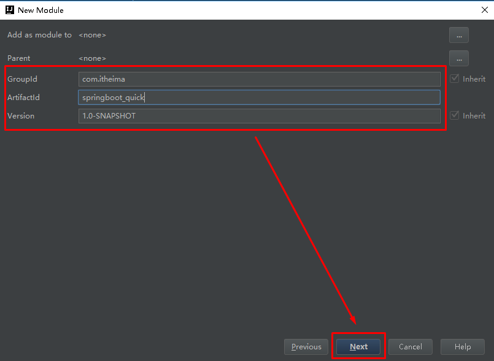
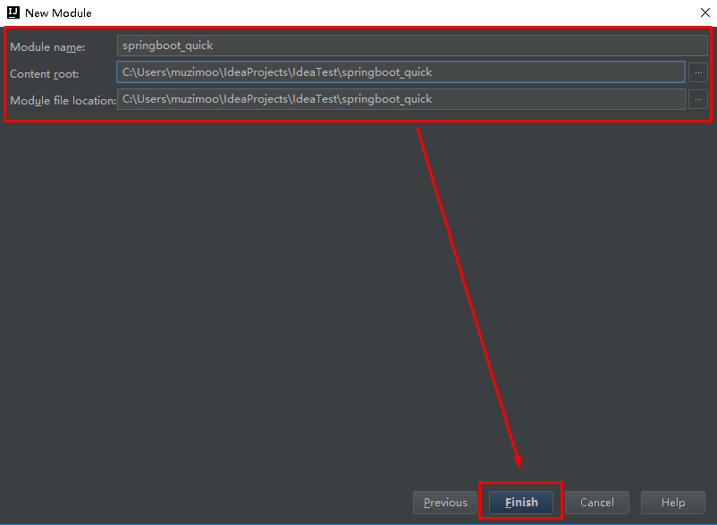

# SpringBoot入门

## 1. SpringBoot的核心功能

- **自动配置**：针对很多Spring应用程序常见的应用功能，SpringBoot能提供相关的配置。

- **起步依赖**：告诉Spring Boot需要什么功能，它就能引入需要的库。避免手动管理依赖库造成的版本冲突问题。

- **命令行界面**：这是Spring Boot的可选特性，借此你只需写代码就能完成完整的应用程序，无需传统项目构建。

- **Actuator**：让你能够深入运行中的Spring Boot应用程序，一探究竟。

SpringBoot本质上就是Spring，SpringBoot是伴随Spring4.0诞生的，在Spring4中出现了条件配置的新特性。SpringBoot2.0是基于Spring5构建的，必须使用JDK8及以上的版本。

### 1.1 自动配置

Spring Boot会为这些常见配置场景进行自动配置。如果Spring Boot在应用程序的Classpath里发现H2数据库的库，那么它就自动配置一个嵌入式H2数据库。如果在Classpath里发现JdbcTemplate，那么它还会为你配置一个JdbcTemplate的Bean。你无需操心那些Bean的配置，Spring Boot会做好准备，随时都能将其注入到你的Bean里。


### 1.2 起步依赖

向项目中添加依赖是件富有挑战的事。你需要什么库？它的Group和Artifact是什么？你需要哪个版本？哪个版本不会和项目中的其他依赖发生冲突？

Spring Boot通过起步依赖为项目的依赖管理提供帮助。起步依赖其实就是特殊的Maven依赖和Gradle依赖，利用了传递依赖解析，把常用库聚合在一起，组成了几个为特定功能而定制的依赖。

举个例子，假设你正在用Spring MVC构造一个REST API，并将JSON（JavaScript Object  Notation）作为资源表述。此外，你还想运用遵循JSR-303规范的声明式校验，并使用嵌入式的Tomcat服务器来提供服务。要实现以上目标，你在Maven或Gradle里至少需要以下8个依赖：

- org.springframework:spring-core  

- org.springframework:spring-web  

- org.springframework:spring-webmvc  

- com.fasterxml.jackson.core:jackson-databind  

- org.hibernate:hibernate-validator 1.1 Spring 风云再起 5  

- org.apache.tomcat.embed:tomcat-embed-core  

- org.apache.tomcat.embed:tomcat-embed-el  

- org.apache.tomcat.embed:tomcat-embed-logging-juli 

不过，如果打算利用Spring Boot的起步依赖，你只需添加Spring Boot的Web起步依赖（org.springframework.boot:spring-boot-starter-web），仅此一个。它会根据依赖传递把其他所需依赖引入项目里，你都不用考虑它们。

比起减少依赖数量，起步依赖还引入了一些微妙的变化。向项目中添加了Web起步依赖，实际上指定了应用程序所需的一类功能。因为应用是个Web应用程序，所以加入了Web起步依赖。与之类似，如果应用程序要用到JPA持久化，那么就可以加入jpa起步依赖。如果需要安全功能，那就加入security起步依赖。简而言之，你不再需要考虑支持某种功能要用什么库了，引入相关起步依赖就行。

此外，Spring Boot的起步依赖还把你从“需要这些库的哪些版本”这个问题里解放了出来。起步依赖引入的库的版本都是经过测试的，因此你可以完全放心，它们之间不会出现不兼容情况。


## 2. SpringBoot快速入门

### 2.1 创建Maven工程

使用idea工具创建一个maven工程，该工程为普通的java工程即可










### 2.2 添加SpringBoot的起步依赖

SpringBoot要求，项目要继承SpringBoot的起步依赖spring-boot-starter-parent

```xml
<parent>
    <groupId>org.springframework.boot</groupId>
    <artifactId>spring-boot-starter-parent</artifactId>
    <version>2.0.1.RELEASE</version>
</parent>
```

SpringBoot要集成SpringMVC进行Controller的开发，所以项目要导入web的启动依赖

```xml
<dependencies>
    <dependency>
        <groupId>org.springframework.boot</groupId>
        <artifactId>spring-boot-starter-web</artifactId>
    </dependency>
</dependencies>
```


#### 2.3 编写SpringBoot引导类

要通过SpringBoot提供的引导类起步SpringBoot才可以进行访问

```java
package com.itheima;

import org.springframework.boot.SpringApplication;
import org.springframework.boot.autoconfigure.SpringBootApplication;

@SpringBootApplication
public class MySpringBootApplication {

    public static void main(String[] args) {
        SpringApplication.run(MySpringBootApplication.class);
    }

}
```

@SpringBootApplication相当于三个标签：Configuration、EnableAutoConfiguration、ComponentScan。引导类最好写在项目的根包中，因为@SpringBootApplication里面的@ComponentScan注解没有指定扫描的包，默认扫描所在包及其子包。

### 2.4 编写Controller

在引导类MySpringBootApplication同级包或者子级包中创建QuickStartController

```java
package com.itheima.controller;

import org.springframework.stereotype.Controller;
import org.springframework.web.bind.annotation.RequestMapping;
import org.springframework.web.bind.annotation.ResponseBody;

@Controller
public class QuickStartController {
    
    @RequestMapping("/quick")
    @ResponseBody
    public String quick(){
        return "springboot 访问成功!";
    }
    
}
```

### 2.5 测试

执行SpringBoot起步类的主方法，控制台打印日志如下：

通过日志发现，Tomcat started on port(s): 8080 (http) with context path ''

tomcat已经起步，端口监听8080，web应用的虚拟工程名称为空

打开浏览器访问url地址为：http://localhost:8080/quick

/img/5.png)

## 3. 项目的其它配置

### 3.1 项目的热部署配置

我们在开发中反复修改类、页面等资源，每次修改后都是需要重新启动才生效，这样每次启动都很麻烦，浪费了大量的时间，我们可以在修改代码后不重启就能生效，在 pom.xml 中添加如下配置就可以实现这样的功能，我们称之为热部署。

```xml
<!--热部署配置-->
<dependency>
    <groupId>org.springframework.boot</groupId>
    <artifactId>spring-boot-devtools</artifactId>
</dependency>
```

注意：IDEA进行SpringBoot热部署失败原因

出现这种情况，并不是热部署配置问题，其根本原因是因为Intellij IEDA默认情况下不会自动编译，需要对IDEA进行自动编译的设置，如下：


然后 Shift+Ctrl+Alt+/，选择Registry


## 3.2 SpringBoot构建插件配置

**构建插件的主要功能是把项目打包成一个可执行的超级JAR（uber-JAR）**，包括把应用程序的所有依赖打入JAR文件内，并为JAR添加一个描述文件，其中的内容能让你用java -jar来运行应用程序。

我们只需要在项目的POM文件中配置如下内容即可：

```xml
<build>
    <plugins>
        <plugin>
            <groupId>org.springframework.boot</groupId>
            <artifactId>spring-boot-maven-plugin</artifactId>
        </plugin>
    </plugins>
</build>
```

因为当前项目的父工程`spring-boot-starter-parent`已经通过pluginManagement对插件的版本和行为进行了约束，所以此处声明该插件即可。