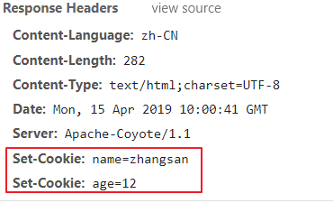

## Cookie的细节

#### 一.Cookie的生命周期

​	默认情况下cookie是会话级别的，即浏览器关闭后则cookie自动删除。

​	但我们也可以设置cookie的作用时间：

```java
cookie.setMaxAge(expiry);//单位：秒
```

​	特殊值：

- expiry = 0：**删除该cookie** 
- expiry  < 0：将该cookie设置为会话级别的cookie
- expiry  > 0：将该cookie持久化

#### 二. Cookie携带中文的问题

​	由于cookie是Web发送的ASCII文本，所以它是不能携带中文的，否则程序会报错：


​	但是我们可以通过`URLEncoder`类将其转码成`application/x-www-form-urlencoded`类型的字符串：

​	在这种字符串中，一个字节由`%xx`组成，xx是两个十六进制数（UTF-8是变长编码方式，一个字符1-4个字节）。

```java
URLEncoder.encode("张三","UTF-8");
```

​	然后通过`URLDecoder`进行解码：

```java
URLDecoder.decode("%E5%A7%93%E5%90%8D","UTF-8");
```

#### 三. Cookie数量和大小的限制

​	Cookie不能无限制的存储，不同的浏览器对cookie的数量和容量都有限制。


​	总之，在进行页面cookie操作的时候，应该尽量保证cookie个数小于20个，总大小 小于4KB

#### 四. Cookie的工作原理

​	当服务在`response`中添加的cookie会在，响应头的`Set-Cookie`中传输给浏览器:

​	

​	当客户端再次访问服务器时，若满足Cookie的携带路径，则将Cookie携带在request中：

​	

