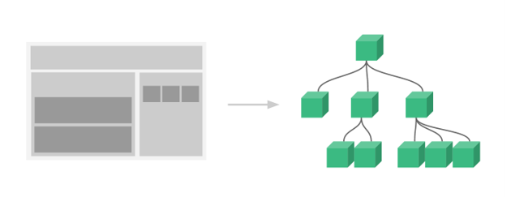
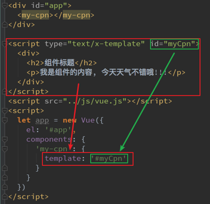
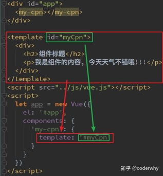
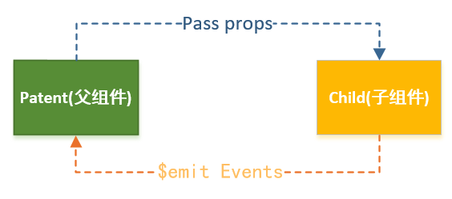
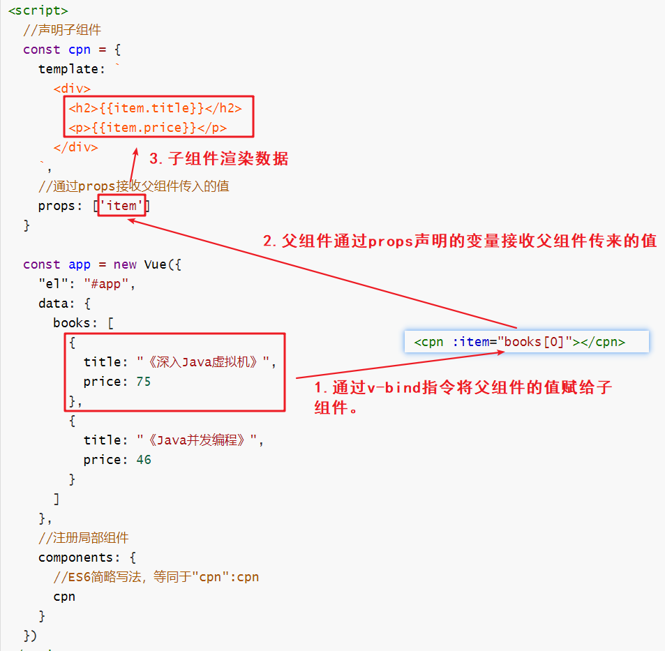
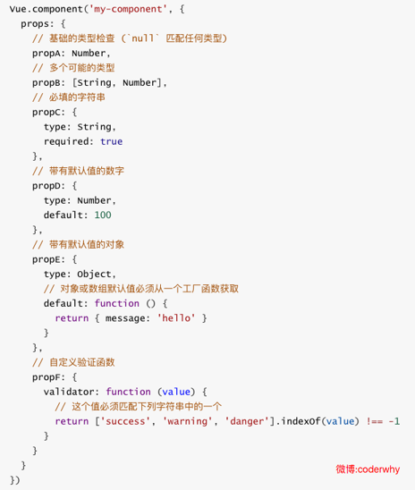

# Vue自定义组件

- [一. 组件化的基本流程](#组件化的基本流程)
- [二. 全局组件和局部组件](#全局组件和局部组件)
- [三. 组件注册的语法糖](#组件注册的语法糖)
- [四. 组件模板的抽离](#组件模板的抽离)
- [五. data必须是一个函数](#data必须是一个函数)
- [六. 组件之间的通信](#组件之间的通信)
  - [6.1 父传子](#父传子)
    - [6.6.1 props数据验证](#props数据验证)
  - [6.2 子传父](#子传父)

组件化是Vue.js中的重要思想，它提供了一种抽象，让我们可以开发出一个个独立可复用的小组件来构造我们的应用。任何的应用都会被抽象成一颗组件树。



## 一. 组件使用的基本流程<a name="组件化的基本流程"> </a>

组件的使用分成三个步骤：

- 创建组件构造器
- 注册组件
- 使用组件

创建组件构造器：

```javascript
const cpn = Vue.extend({
  template: `
    <div>
      <h2>标题</h2>
      <p>内容1</p>
      <p>内容2</p>
    </div>
  `
})
```

注册组件：

```java
//第一个参数是组件的标签名，第二个参数是组件的构造器
Vue.component('cpn',cpn);
```

使用组件：

```html
<cpn></cpn>
```

**Vue.extend()**：

- 调用Vue.extend()创建的是一个组件构造器。 
- 通常在创建组件构造器时，传入template代表我们自定义组件的模板。
- 该模板就是在使用到组件的地方，要显示的HTML代码。
- 事实上，这种写法在Vue2.x的文档中几乎已经看不到了，它会直接使用下面我们会讲到的语法糖，但是在很多资料还是会提到这种方式，而且这种方式是学习后面方式的基础。

**Vue.component()**：

- 调用Vue.component()是将刚才的组件构造器注册为一个组件，并且给它起一个组件的标签名称。

- 所以需要传递两个参数：1.注册组件的标签名、2.组件构造器

## 二. 全局组件和局部组件<a name="全局组件和局部组件"> </a>

### 2.1 全局组件

当我们通过调用Vue.component()注册组件时，组件的注册是全局的。这意味着该组件可以在任意Vue实例下使用。我们下面创建了两个Vue实例，然后通过注册全局组件，在两个Vue实例所管理的HTML标签下都能够使用该组件：

```html
<!--全局组件能够在多个Vue实例中使用-->
<!DOCTYPE html>
<html lang="en">
<head>
  <meta charset="UTF-8">
  <title>Title</title>
</head>
<body>
  <div id="app1">
    <cpn></cpn>
  </div>
  <div id="app2">
    <cpn></cpn>
  </div>
</body>
<script src="./js/vue.js"></script>
<script>
  const cpn = Vue.extend({
    template: `
      <div>
        <h2>标题</h2>
        <p>内容1</p>
        <p>内容2</p>
      </div>
    `
  })
  //注册全局组件
  Vue.component('cpn', cpn);
  const app1 = new Vue({
    "el": "#app1",
    data: {}
  });
  const app2 = new Vue({
    "el": "#app2",
    data: {}
  });
</script>
</body>
</html>
```

### 2.2 局部组件

如果我们注册的组件是挂载在某个实例中, 那么就是一个局部组件：

```javascript
const app2 = new Vue({
  "el": "#app2",
  data: {},
  //注册局部组件，局部组件只能在当前实例中使用
  components: {
    'cpn': cpn
  }
});
```

## 三. 组件注册的语法糖<a name="组件注册的语法糖"> </a>

在上面介绍了组件注册的方式，可能会有些繁琐。在Vue官网上介绍的是简化的注册方式，主要是省去了调用Vue.extend()的步骤，可以直接使用一个对象来代替：

```javascript
Vue.component('cpn', {
  template: `
    <div>
      <h2>标题</h2>
      <p>内容1</p>
      <p>内容2</p>
    </div>`  
});
```

## 四. 组件模板的抽离<a name="组件模板的抽离"> </a>

刚才，我们通过语法糖简化了Vue组件的注册过程，另外还有一个地方的写法比较麻烦，就是template模块写法.如果我们能将其中的HTML分离出来写，然后挂载到对应的组件上，必然结构会变得非常清晰。Vue提供了两种方案来定义HTML模块内容：

### 4.1 使用`<script>`标签



### 4.2 使用`<template>`标签



## 五. data必须是一个函数<a name="data必须是一个函数"> </a>

**一个组件的 data 选项必须是一个函数**，因此每个实例可以维护一份被返回对象的独立的拷贝。

```javascript
Vue.component('cpn', {
  template: `
    <div>
      <h2>{{title}}</h2>
      <p>{{content1}}</p>
      <p>{{content2}}</p>
    </div>
  `,
  data() {
    return {
      title: "标题",
      content1: "内容一",
      content2: "内容二"
    }
  }
});
```

## 六. 组件之间的通信<a name="组件之间的通信"> </a>



- Parent->Child：通过props向子组件传递数据。
- Child->Parent：通过事件向父组件发送消息。

### 6.1 父传子 <a name="父传子"> </a>

在开发中，往往一些数据确实需要从上层传递到下层。比如在一个页面中，我们从服务器请求到了很多的数据，其中一部分数据，并非是我们整个页面的大组件来展示的，而是需要下面的子组件进行展示。这个时候，并不会让子组件再次发送一个网络请求，而是直接让大组件(父组件)将数据传递给小组件(子组件)。

```html
<!--全局组件能够在多个Vue实例中使用-->
<!DOCTYPE html>
<html lang="en">
<head>
  <meta charset="UTF-8">
  <title>Title</title>
</head>
<body>
<div id="app">
  <cpn :item="books[0]"></cpn>
  <cpn :item="books[1]"></cpn>
</div>
</body>
<script src="./js/vue.js"></script>
<script>
  //声明子组件
  const cpn = {
    template: `
      <div>
        <h2>{{item.title}}</h2>
        <p>{{item.price}}</p>
      </div>
    `,
    //通过props接收父组件传入的值
    props: ['item']
  }
  
  const app = new Vue({
    "el": "#app",
    data: {
      books: [
        {
          title: "《深入Java虚拟机》",
          price: 75
        },
        {
          title: "《Java并发编程》",
          price: 46
        }
      ]
    },
	//注册局部组件
    components: {
      //ES6简略写法，等同于"cpn":cpn
      cpn
    }
  })
</script>
</body>
</html>
```



#### 6.1.1 props数据验证 <a name="props数据验证"> </a>

在前面，我们的props选项是使用一个数组。我们说过，除了数组之外，我们也可以使用对象，当需要对**props**进行类型等验证时，就需要对象写法了。验证都支持哪些数据类型呢？

- String
- Number
- Boolean
- Array
- Object
- Date
- Funciton
- Symbol

当我们有自定义构造函数时，验证也支持自定义的类型。

数据验证的写法举例：



### 6.2 子传父<a name="子传父"> </a>

