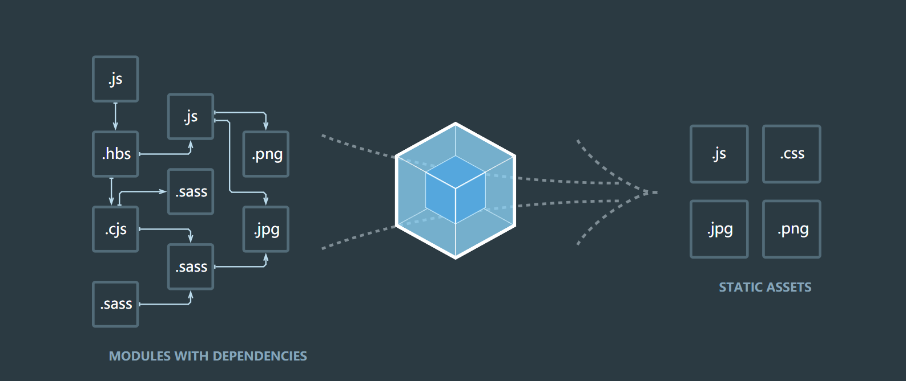
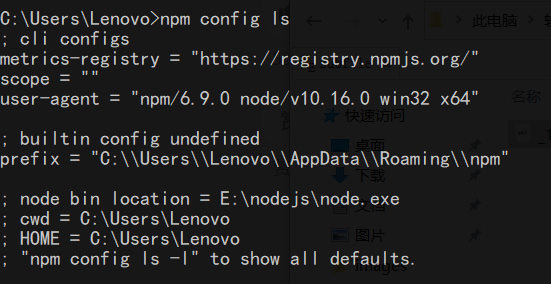

# Webpack安装与入门

> 说明：本文转载至<https://www.jianshu.com/p/6edbdfca1370>

## 一. 概述

使用vue.js开发大型应用需要使用webpack打包工具，Webpack 是一个前端资源的打包工具，它可以将js、image、css等资源当成一个模块进行打包。



从图中我们可以看出，Webpack 可以将js、css、png等多种静态资源 进行打包，使用webpack有什么好处呢？

1、模块化开发
 程序员在开发时可以分模块创建不同的js、 css等小文件方便开发，最后使用webpack将这些小文件打包成一个文件，减少了http的请求次数。
 webpack可以实现按需打包，为了避免出现打包文件过大可以打包成多个文件。

2、 编译typescript、ES6等高级js语法
 随着前端技术的强大，开发中可以使用javascript的很多高级版本，比如：typescript、ES6等，方便开发，
 webpack可以将打包文件转换成浏览器可识别的js语法。

3、CSS预编译
 webpack允许在开发中使用Sass 和 Less等原生CSS的扩展技术，通过sass-loader、less-loader将Sass 和 Less的语法编译成浏览器可识别的css语法。

## 二. 安装

### 2.1 安装Node和NPM

webpack基于node.js运行，所以需要安装Node.js。安装Node.js时会自动安装NPM包管理工具。安装完成后我们可以通过下列命令查看Node.js和npm是否安装成功。

```shell
node -v
npm -v
```

安装成功后我们需要设置一下npm从远程下载的js包所存放的路径，使用`npm config ls`命令查看。



这里我们可以自定义保存的路径：

```shell
npm config set prefix "E:\JAVA_Development\npm_modules"
```

### 2.2 安装cnpm

npm默认会去国外的镜像去下载js包，在开发中通常我们使用国内镜像，这里我们使用淘宝镜像
 下边我们来安装cnpm：

有时我们使用npm下载资源会很慢，所以我们可以安装一个cnmp(淘宝镜像)来加快下载速度。

输入命令，进行全局安装淘宝镜像。

```shell
 npm install -g cnpm --registry=<https://registry.npm.taobao.org>
```

### 2.3 安装Webpack

新建webpack进入目录：

```shell
npm install --save-dev webpack 或 cnpm install --save-dev webpack

npm install --save-dev webpack-cli (4.0以后的版本需要安装webpack-cli)
```

2）全局安装加-g，如下：
 全局安装就将webpack的js包下载到npm的包路径下

```shell 
npm install webpack -g 或 cnpm install webpack -g
```

3）安装webpack指定的版本：
 进入webpack目录，运行：

```shell
cnpm install --save-dev webpack@3.6.0

npm install webpack@3.6.0 -g或 cnpm install webpack@3.6.0 -g  #全局安装
```

在cmd状态输入`webpack -v`，如果输出了版本号则证明安装成功。


## 三. 入门使用

