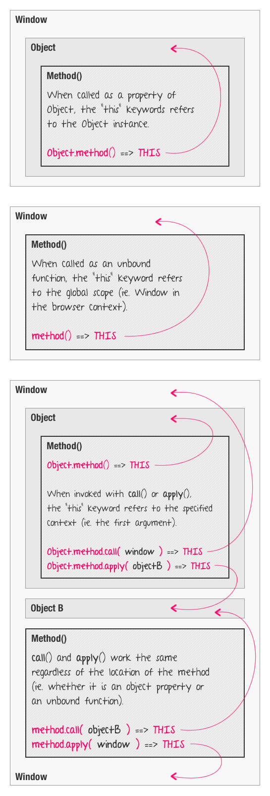

# JS中函数的this指针

> 本文转载至：<https://www.cnblogs.com/kidsitcn/p/10985338.html>

this关键字对于javascript初学者，即便是老手可能都是一个比较容易搞晕的东西。本文试图理顺这个问题。

## 一. this和自然语言的类比

实际上js中的this和我们自然语言中的代词有类似性。比如英语中我们写"John is running fast because **he** is trying to catch the train"

注意上面的代词"he",我们当然可以这样写:"John is running fast because **John** is trying to catch the train" ,这种情况下我们没有使用this去重用代替John。

在js中this关键字就是一个引用的shortcut,他指代一个object，是执行的代码body的context环境。看下面的代码:

```js
var person = {
    firstName: "Penelope",
    lastName: "Barrymore",
    fullName: function () {
        // Notice we use "this" just as we used "he" in the example sentence earlier?:
        console.log(this.firstName + " " + this.lastName);
    	// We could have also written this:​
        console.log(person.firstName + " " + person.lastName);
    }
}
```

如果我们使用person.firstName,person.lastName的话，我们的代码可能会产生歧义。比如，如果有一个全局变量，名字就是person,那么person.firstName可能试图从全局的person变量来访问其属性，这可能导致错误，并且难以调试。因此，我们使用this关键字，不仅为了代码更美(作为以个referent)，而且为了更加精确而不会产生歧义。类似于刚刚举例的自然语言中，因为代词"he"使得句意更清晰，因为更加清晰地表明我们正在引用一个特定的John这个人。

正如代词"he"用于引用存于context中无歧义的名词一样，this关键字用于引用一个对象，而这个对象就是function(在该函数中，使用了this指针)所绑定的对象.(the this keyword is similarly used to refer to an object that the function(where this is used) is bound to.) 

## 二. this基础

### 2.1 什么是执行上下文(execution context)?

在js中，所有的函数体(function body)都能访问this关键字. **this keyword就是函数执行的context.默认情况下，this引用着调用该函数的那个对象(也就是thisObj.thisFunction中的thisObj)**(this is a reference to the object on which a particular function is called),在js中，所有的函数都会被绑定到一个object.然而，我们可以使用call(), apply()来在运行时变更这种binding关系。

首先，我们需要澄清的是：js中所有的函数实际上都是"methods".也就是说**所有的function都是某个对象的属性**。虽然我们可以定义看起来像是独立自由的函数，但是实际上这时候，这些含糊被隐式地被创建为window object的属性properties(在node环境中是其他的object,可能是process)。这也就意味着，即使我们创建一个自由独立的function而没有显然指定其context，我们也可以以window属性的方式来调用该函数。

```js
// Define the free-floating function.
function someMethod(){ ... }

// Access it as a property of Window.
window.someMethod();
```

既然我们知道了js的所有函数度作为一个对象的属性而存在，我们可以具体探讨下执行上下文的默认绑定这个概念了。默认情况下，一个**js函数在该函数所属的对象的上下文中执行**(js function is executed in the context of the object for which it is a property).也就是说，在函数body中，this关键词就是对父亲对象的引用，看看下面的代码:

```js
//  "this" keyword within the sayHello() method is a reference to the sarah object
sarah.sayHello();
// "this" keyword within the getScreenResolution() function is a reference to the window object (since unbound functions are implicitly bound to the global scope)
getScreenResolution();
```

以上是默认的情况，除此之外，js提供了一种变更任何一个method的执行上下文的机制: call()或者apply().这两个函数都能用于绑定"this"关键字到一个明确的context(object)上去。

```js
method.call( newThisContext, Param1, ..., Param N )
method.apply( newThisContext, [ Param1, ..., Param N ] );
```



再看一个复杂一点的代码案例:

```js
<!DOCTYPE html>
<html>
<head>
    <title>Changing Execution Context In JavaScript</title>

    <script type="text/javascript">
        // Create a global variable for context (this lives in the
        // global scope - window).
        var context = "Global (ie. window)";
        // Create an object.
        var objectA = {
            context: "Object A"
        };
        // Create another object.
        var objectB = {
            context: "Object B"
        };
        // -------------------------------------------------- //
        // -------------------------------------------------- //
        // Define a function that uses an argument AND a reference
        // to this THIS scope. We will be invoking this function
        // using a variety of approaches.
        function testContext( approach ){
            console.log( approach, "==> THIS ==>", this.context );
        }
        // -------------------------------------------------- //
        // -------------------------------------------------- //
        // Invoke the unbound method with standard invocation.
        testContext( "testContext()" );
        // Invoke it in the context of Object A using call().
        testContext.call(
            objectA,
            ".call( objectA )"
        );
        // Invoke it in the context of Object B using apply().
        testContext.apply(
            objectB,
            [ ".apply( objectB )" ]
        );
        // -------------------------------------------------- //
        // -------------------------------------------------- //
        // Now, let's set the test method as an actual property
        // of the object A.
        objectA.testContext = testContext;
        // -------------------------------------------------- //
        // -------------------------------------------------- //
        // Invoke it as a property of object A.
        objectA.testContext( "objectA.testContext()" );
        // Invoke it in the context of Object B using call.
        objectA.testContext.call(
            objectB,
            "objectA.testContext.call( objectB )"
        );
        // Invoke it in the context of Window using apply.
        objectA.testContext.apply(
            window,
            [ "objectA.testContext.apply( window )" ]
        );
    </script>
</head>
<body>
    <!-- Left intentionally blank. -->
</body>
</html>
```

 以上代码的输出如下:

```js
testContext() ==> THIS ==> Global (ie. window)
.call( objectA ) ==> THIS ==> Object A
.apply( objectB ) ==> THIS ==> Object B
objectA.testContext() ==> THIS ==> Object A
objectA.testContext.call( objectB ) ==> THIS ==> Object B
objectA.testContext.apply( window ) ==> THIS ==> Global (ie. window)
```

## 三. 另一个角度来看this-functionObj.this

首先，需要知道的是js中的所有函数都有peroperties,就像objects都有properties一样，因为function本身也是一个object对象。**this可以看作是this-functionObj的属性**，并且只有**当该函数执行时，该函数对象的this属性将会被赋值**，"it gets the this property ---- a variable with the value of the object that invokes the function where this is used"

this总是指向或者说引用(并包含了对应的value)一个对象，并且**this往往在一个function或者说method中来使用**。注意：虽然在global scope中我们可以不在function body中使用this,而是直接在global scope中使用this(实际上指向了window)，但是如果我们在**strict mode**的话，在global function中，或者说**没有绑定任何object的匿名函数中，如果使用this, 那么这个this将是undefined值**.

假设this在一个function A中被使用，那么this就将引用着调用 function A的那个对象。我们需要这个this来访问调用function A对象的method和property.特别地，有些情况下我们不知道调用者对象的名称，甚至有时候调用者对象根本没有名字，这时就必须用this关键字了！

```js
var person = {
	firstName   :"Penelope",
	lastName    :"Barrymore",
	showFullName:function () {
		console.log (this.firstName + " " + this.lastName);
	}
}
person.showFullName (); // Penelope Barrymore
```

再看一个jquery事件处理函数中使用this关键字的常见例子:

```js
// A very common piece of jQuery code
$ ("button").click (function (event) {
	// $(this) will have the value of the button ($("button")) object
	// because the button object invokes the click () method， this指向button
	console.log ($ (this).prop ("name"));
});
```

### 3.1 深入一步理解this

我们先抛出一个心法: this不会有value，直到一个object invoke了这个函数(this在这个函数中使用).为了行文方便，我们将使用this关键字的函数称为thisFunction.

虽然默认情况下，this都会引用定义了this(也就是有this引用）的对象，但是只到一个对象调用了thisFunction,这个this指针才会被赋值。而这个this value只决定于调用了thisFunction的对象。尽管默认情况下this的值就是invoking ojbect(xxObj.thisFunction)，但是我们也可以通过xxObj.thisFunction.call(yyObj,parameters), apply()等方式来修改this的默认值!

#### 在global scope中使用this

**在global scope中，当代码在浏览器中执行时，所有的全局variable和function都被定义在window object上**，因此，在一个全局函数中当使用this时，this是引用了全局的window对象的(注意必须是非stric mode哦),而window对象则是整个js应用或者说web page的容器


## 四. DOM 事件处理函数中的 this & 内联事件中的 this

### 4.1 DOM事件处理函数

当函数被当做监听事件处理函数时， 其 this 指向触发该事件的元素 （针对于addEventListener事件）

```js
// 被调用时，将关联的元素变成蓝色
function bluify(e){
  //在控制台打印出所点击元素
  console.log(this);
  //阻止事件冒泡
  e.stopPropagation();
  //阻止元素的默认事件
  e.preventDefault();      
  this.style.backgroundColor = '#A5D9F3';
}

// 获取文档中的所有元素的列表
var elements = document.getElementsByTagName('*');

// 将bluify作为元素的点击监听函数，当元素被点击时，就会变成蓝色
for(var i=0 ; i<elements.length ; i++){
  elements[i].addEventListener('click', bluify, false);
}
```

### 4.2 内联事件

当代码被内联处理函数调用时，它的this指向监听器所在的DOM元素

```html
button onclick="hello(this)">
    Show inner this
</button>
function hello(obj){
	console.info(obj); //输出DOM对象
}
```


## 五. 函数中的this指针

```js
function Hello(a, b) {
    this.a = a;
    this.b = b;
    console.info(this);
}

let hello1 = new Hello('1','2');//当作为构造函数时，this指向当前创建的对象
Hello(); // 作为函数调用时this指向window
```


最后，需要牢记：

**Always remember that this is assigned the value of the object that invoked the this Function**


参考文章：

[两个例子明白箭头函数this指向](https://blog.csdn.net/w390058785/article/details/82884032)

[【JavaScript】常见的隐式改变this指向的几种错误](https://blog.csdn.net/w390058785/article/details/80078138)

