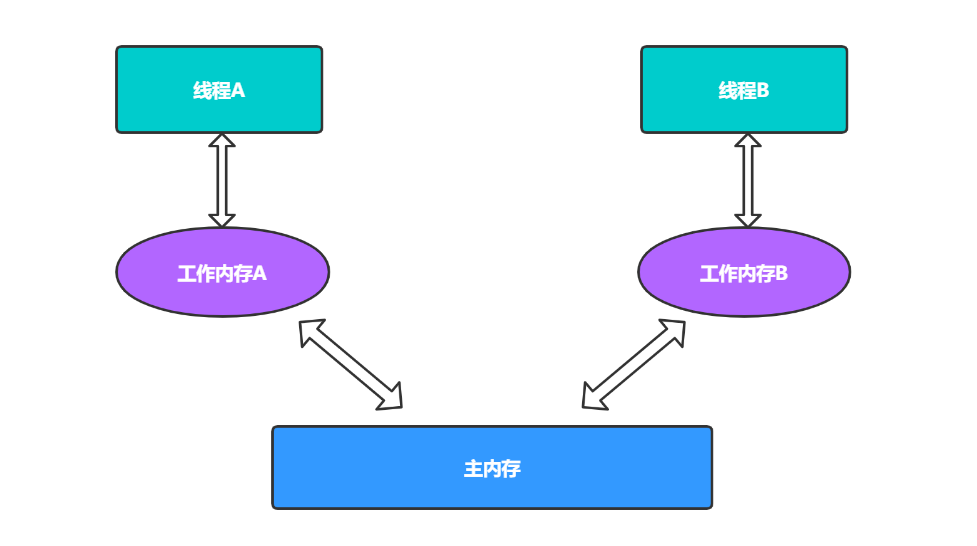
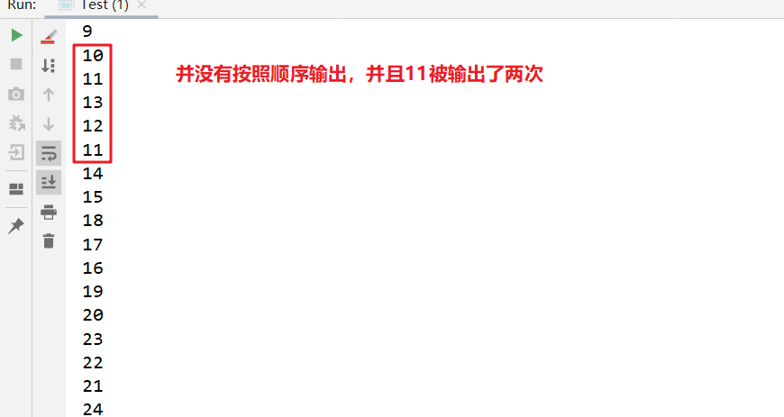

# volatile关键字

volatile是Java提供的一种轻量级的同步机制。Java 语言包含两种内在的同步机制：同步块（或方法）和 volatile 变量，相比于synchronized（synchronized通常称为重量级锁），volatile更轻量级，因为它不会引起线程上下文的切换和调度。但是volatile 变量的同步性较差（有时它更简单并且开销更低），而且其使用也更容易出错。

## 1. 并发编程的三个基本概念

### 1.1 原子性

定义： 即一个操作或者多个操作 要么全部执行并且执行的过程不会被任何因素打断，要么就都不执行。

原子性是拒绝多线程操作的，不论是多核还是单核，具有原子性的量，同一时刻只能有一个线程来对它进行操作。简而言之，在整个操作过程中不会被线程调度器中断的操作，都可认为是原子性。例如 a=1是原子性操作，但是a++和a +=1就不是原子性操作。

**Java中的原子性操作包括**：

- 基本类型的读取和赋值操作，且赋值必须是数字赋值给变量，变量之间的相互赋值不是原子性操作。
- 所有引用reference的赋值操作
- java.concurrent.Atomic.* 包中所有类的一切操作

### 1.2 可见性

定义：指当多个线程访问同一个变量时，一个线程修改了这个变量的值，其他线程能够立即看得到修改的值。

在多线程环境下，一个线程对共享变量的操作对其他线程是不可见的。Java提供了volatile来保证可见性，当一个变量被volatile修饰后，表示着线程本地内存无效，当一个线程修改共享变量后他会立即被更新到主内存中，其他线程读取共享变量时，会直接从主内存中读取。当然，synchronize和Lock都可以保证可见性。synchronized和Lock能保证同一时刻只有一个线程获取锁然后执行同步代码，并且在释放锁之前会将对变量的修改刷新到主存当中。因此可以保证可见性。

### 1.3 有序性

定义：即程序执行的顺序按照代码的先后顺序执行。

Java内存模型中的有序性可以总结为：如果在本线程内观察，所有操作都是有序的；如果在一个线程中观察另一个线程，所有操作都是无序的。前半句是指“线程内表现为串行语义”，后半句是指“指令重排序”现象和“工作内存主主内存同步延迟”现象。

在Java内存模型中，为了效率是允许编译器和处理器对指令进行重排序，当然重排序不会影响单线程的运行结果，但是对多线程会有影响。Java提供volatile来保证一定的有序性。最著名的例子就是单例模式里面的DCL（双重检查锁）。另外，可以通过synchronized和Lock来保证有序性，synchronized和Lock保证每个时刻是有一个线程执行同步代码，相当于是让线程顺序执行同步代码，自然就保证了有序性。

## 2. Java内存模型以及共享变量的可见性

JMM决定一个线程对共享变量的写入何时对另一个线程可见，JMM定义了线程和主内存之间的抽象关系：共享变量存储在主内存(Main Memory)中，每个线程都有一个私有的本地内存（Local Memory，有些文章将其称为工作内存），本地内存保存了被该线程使用到的主内存的副本拷贝，线程对变量的所有操作都必须在工作内存中进行，而不能直接读写主内存中的变量。




对于普通的共享变量来讲，线程A将其修改为某个值发生在线程A的本地内存中，此时还未同步到主内存中去；而线程B已经缓存了该变量的旧值，所以就导致了共享变量值的不一致。解决这种共享变量在多线程模型中的不可见性问题，较粗暴的方式自然就是加锁，但是此处使用synchronized或者Lock这些方式太重量级了，比较合理的方式其实就是volatile。

需要注意的是，JMM是个抽象的内存模型，**所以所谓的本地内存，主内存都是抽象概念，并不一定就真实的对应cpu缓存和物理内存**。

## 3. 锁的互斥与可见性

锁提供了两种主要特性：互斥（mutual exclusion） 和可见性（visibility）。

1. 互斥即一次只允许一个线程持有某个特定的锁，一次就只有一个线程能够使用该共享数据。

2. 可见性要更加复杂一些，它必须确保释放锁之前对共享数据做出的更改对于随后获得该锁的另一个线程是可见的。也即当一条线程修改了共享变量的值，新值对于其他线程来说是可以立即得知的。如果没有同步机制提供的这种可见性保证，线程看到的共享变量可能是修改前的值或不一致的值，这将引发许多严重问题。


## 4. volatile变量的特性

### 4.1 保证可见性，不保证原子性

- 可见性：当某个线程修改volatile变量时，JMM会强制将这个修改更新到主内存中，并且让其他线程工作内存中存储的副本失效。
- volatile变量并不能保证其操作的原子性，具体来说像i++这种操作并不是原子操作，使用volatile修饰变量后仍然不能保证这一点。具体体现我们看下面的代码：

```java
public class Test {
    private static volatile int count = 0;

    public static void main(String[] args){
        Thread[] threads = new Thread[5];
        for(int i = 0; i<5; i++){
            threads[i] = new Thread(()->{
                try{
                    for(int j = 0; j<10; j++){
                        System.out.println(++count);
                        Thread.sleep(500);
                    }
                }catch (Exception e){
                    e.printStackTrace();
                }
            });
            threads[i].start();
        }
    }
}
```

生成5条线程，每条线程都对count执行10次自增操作，我们预期结果是1-50均匀的打印出来，但不管运行多少次，都无法得到期望的结果：



这说明仅仅保证数据的可见性并不能保证线程安全，具体原因我们来分析一下：

首先我们需要明确的是，count++操作并不是原子操作，因为自增操作包括三个基本指令：读取数据、计算数据、返回结果，可以看看i++相关的字节码：

```java
Code:
       0: getstatic	//读取原数据
       3: iconst_1	//定义常量1
       4: iadd	//计算数据
       5: putstatic  //输出结果                 // Field count:I
       8: return
```

**现象一**：数据没有按顺序输出

假如线程A获取执行权，并在“返回结果”后停止（未打印），而转为线程B执行操作，巧合的是线程B这三步操作在一个时间片中完成：读取数据、计算数据、返回结果、打印数据，然后时间片转回线程A，线程打印刚刚计算的数据，此时就会发生先打印的数据比后打印的数据大的问题。

**现象二**：数据输出重复

假如线程A获取执行权，并在“读取数据”后停止；线程B开始执行，由于线程A还没有进行数据计算和数据返回操作，也就是说主内存中的数据并没有更新，而此时B线程完成自增操作，并且输出结果。转回线程A，由于它已经完成了数据读取工作，它将继续往下执行，但是它现在读取的数据已经是一个过期数据了，最终输出结果会和B线程输出的一样。

所以保证数据可见性并不能保证线程安全，**事实上就是保证操作是原子性操作，才能保证使用volatile关键字的程序在并发时能够正确执行**。而锁机制刚好能保证操作的原子性和可见性。而锁机制之所以能保证原子性，是因为锁有互斥性，并且对于一个已经竞争到同步锁的线程，在还没有走出同步块的时候，即使时间片结束也不会释放锁，

### 4.2 禁止指令重排

指令重排是指JVM在编译Java代码的时候，或者CPU在执行JVM字节码的时候，对现有的指令顺序进行重新排序

指令重排的目的是为了在不改变程序执行结果的前提下，优化程序的运行效率。需要注意的是，这里所说的不改变执行结果，指的是不改变单线程下的程序执行结果。

**重排序操作不会对存在数据依赖关系的操作进行重排序。**比如：a=1;b=a; 这个指令序列，由于第二个操作依赖于第一个操作，所以在编译时和处理器运时这两个操作不会被重排序。

**重排序是为了优化性能，但是不管怎么重排序，单线程下程序的执行结果不能被改变**。比如：a=1;b=2;c=a+b这三个操作，第一步（a=1)和第二步(b=2)由于不存在数据依赖关系， 所以可能会发生重排序，但是c=a+b这个操作是不会被重排序的，因为需要保证最终的结果一定是c=a+b=3。

然而，指令重排是一把双刃剑，重排序在单线程下一定能保证结果的正确性，但是在多线程环境下，可能发生重排序，影响结果，下例中的1和2由于不存在数据依赖关系，则有可能会被重排序，先执行status=true再执行a=2。而此时线程B会顺利到达4处，而线程A中a=2这个操作还未被执行，所以b=a+1的结果也有可能依然等于2。

```java
public class TestVolatile {
    int a = 1;
    boolean status = false;

    /**
     * 状态切换为true
     */
    public void changeStatus() {
        a = 2;
        status = true;
    }

    /**
     * 若状态为true,则running
     */
    public void run() {
        if (status) {
            int b = a + 1;
            System.out.println(b);
        }
    }
}
```

使用volatile关键字修饰共享变量便可以禁止这种重排序。若用volatile修饰共享变量，在编译时，会在指令序列中插入内存屏障来禁止特定类型的处理器重排序,volatile禁止指令重排序也有一些规则：

1. 当程序执行到volatile变量的读操作或者写操作时，在其前面的操作的更改肯定全部已经进行，且结果已经对后面的操作可见；在其后面的操作肯定还没有进行；

2. 在进行指令优化时，不能将在对volatile变量访问的语句放在其后面执行，也不能把volatile变量后面的语句放到其前面执行。

**通俗的说就是执行到volatile变量时，其前面的所有语句都执行完，后面所有语句都未执行。且前面语句的结果对volatile变量及其后面语句可见**。


## 5. volatile的原理

volatile可以保证线程可见性且提供了一定的有序性，但是无法保证原子性。在JVM底层volatile是采用“内存屏障”来实现的。观察加入volatile关键字和没有加入volatile关键字时所生成的汇编代码发现，加入volatile关键字时，会多出一个lock前缀指令，lock前缀指令实际上相当于一个内存屏障（也成内存栅栏），内存屏障会提供3个功能：

1. 它确保指令重排序时不会把其后面的指令排到内存屏障之前的位置，也不会把前面的指令排到内存屏障的后面；即在执行到内存屏障这句指令时，在它前面的操作已经全部完成；

2. 它会强制将对缓存的修改操作立即写入主存；

3. 如果是写操作，它会导致其他CPU中对应的缓存行无效。


## 6. 单例模式的双重锁为什么要加volatile


需要volatile关键字的原因是，在并发情况下，如果没有volatile关键字，在第5行会出现问题。instance = new TestInstance()；可以分解为3行伪代码:

- memory = allocate() //分配内存

- ctorInstanc(memory) //初始化对象

- instance = memory //设置instance指向刚分配的地址

上面的代码在编译运行时，可能会出现重排序从a-b-c排序为a-c-b。在多线程的情况下会出现以下问题。当线程A在执行第5行代码时，B线程进来执行到第2行代码。假设此时A执行的过程中发生了指令重排序，即先执行了a和c，没有执行b。那么由于A线程执行了c导致instance指向了一段地址，所以B线程判断instance不为null，会直接跳到第6行并返回一个未初始化的对象。

**参考文章**：

- https://blog.csdn.net/u012723673/article/details/80682208

- https://mp.weixin.qq.com/s?__biz=MzIxMjE5MTE1Nw==&mid=2653192450&idx=2&sn=ad95717051c0c4af83923b736a5bc637&chksm=8c99f3d8bbee7aceb123e4f6aa9a220630b5aa17743ba812d82308bfb6a8ed8303bdd181f144&mpshare=1&scene=23&srcid=0929Elncx0R0l02WWFrc9Cpt&sharer_sharetime=1569734533458&sharer_shareid=e81601a95b901aeca142bbe3b957819a#rd

  