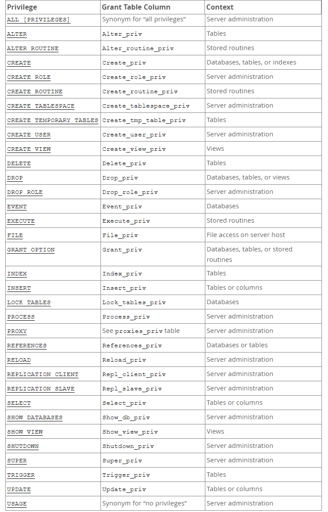
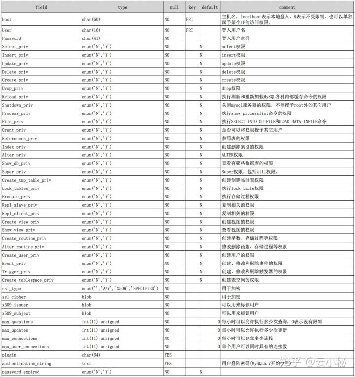

# MySQL用户及权限

> 本文转载至：https://zhuanlan.zhihu.com/p/55798418

## **引言**

数据库保存着应用程序日积夜累记录下来的数据资产，安全级别特别高，所以只能让授权的用户可以访问，其他用户需一律拒绝。MySQL是一个多用户数据库，拥有功能强大的访问控制系统，可以为不同的用户指定不同的权限。 小编一直对MySQL的用户及权限管理都是一知半解，存有疑问，具体疑问如下:

**1.MySQL如何认证一个用户？**

小编认为"用户认证"就是为了解决一个问题:你是谁？。在国内，中国公民要证明他是谁，只要拿出身份证就可以，因为身份证上的照片，姓名，家庭住址，性别，出生年月，身份证号码等信息，是中国政府为了说明你就是中国大地上某个地方的某某某而制定的。那么在MySQL Server中，一个用户是如何认证的？

**2.MySQL的权限分哪几种及存储在什么地方？**

小编认为"MySQL权限"是为了解决一个问题: 你能在MySQL Server内干哪些事情？就好比图书馆一样，只有办了卡的人才允许进入，不同的卡可以进入不同的图书馆区域，可以做不同的事情，即拥有不一样的权限，那么MySQL的权限有哪些？并且这些权限存储在哪里？

**3. MySQL是如何控制用户访问的？**

继续使用图书馆的栗子，当你要进图书馆的时候，需要刷卡或者与管理员沟通，如果无效，那么将会出现谢绝参阅的礼貌回复；假如你有权限进入图书馆，但是你没有借书的权利，那么在你借书的时候，会借书失败。在MySQL Server中， 一个用户想要对MySQL Server进行操作，MySQL Server是如何控制用户行为的？

## **一、MySQL用户认证**

MySQL的用户认证形式是: 用户名+主机。比如test@127.0.0.1和test@192.168.10.10是不一样的用户。就好比现实中的牛家村的张三和马家村的张三是分别两个人一样。MySQL中的权限分配都是分配到用户+主机的实体上。MySQL的主机信息可以是本地(localhost)，某个IP，某个IP段，以及任何地方等，即用户的地址可以限制到某个具体的IP，或者某个IP范围，或者任意地方。MySQL用户分为普通用户和root用户。root用户是超级管理员，拥有所有权限，普通用户只拥有被授予的各种权限。

## **二、MySQL的权限分类及存储**

**1.MySQL用户权限层级**

- 全局层级：全局权限适用于一个给定MySQL Server中的所有数据库，这些权限存储在`mysql.user`表中。

```text
GRANT ALL ON *.* TO 'user'@'host'; 
```

`*.* `表示数据库库的所有库和表，对应权限存储在`mysql.user`表中

- 数据库层级：数据库权限适用于一个给定数据库中的所有目标，这些权限存储在mysql.db表中。

```text
GRANT ALL ON mydb.* TO 'user'@'host';
```

`mydb.*` 表示`mysql`数据库下的所有表，对应权限存储在`mysql.db`表中

- 表层级：表权限适用于一个给定表中的所有列，这些权限存储在`mysql.tables_priv`表中。

```text
GRANT ALL ON mydb.mytable TO 'user'@'host';
```

`mydb.mytable` 表示`mysql`数据库下的`mytable`表，对应权限存储在`mysql.tables_priv`表

- 列层级：列权限使用于一个给定表中的单一列，这些权限存储在`mysql.columns_priv`表中。

```text
GRANT ALL (col1， col2， col3)  ON mydb.mytable TO 'user'@'host';
```

`mydb.mytable` 表示`mysql`数据库下的`mytable`表， col1, col2,  col3表示`mytable`表中的列名

- 子程序层级：CREATE ROUTINE、ALTER ROUTINE、EXECUTE和GRANT权限适用于已存储的子程序。这些权限可以被授予为全局层级和数据库层级。而且，除了CREATE ROUTINE外，这些权限可以被授予子程序层级，并存储在`mysql.procs_priv`表中。

```text
GRANT EXECUTE ON PROCEDURE mydb.myproc TO 'user'@'host';
```

`mydb.mytable` 表示`mysql`数据库下的`mytable`表，PROCEDUR表示存储过程

**2. MySQL权限简单分类**

- **数据权限**分为：库、表和字段三种级别
- **管理权限**主要是管理员要使用到的权限，包括：数据库创建，临时表创建、主从部署、进程管理等
- **程序权限**主要是触发器、存储过程、函数等权限。


**3. MySQL权限详情**



> 第一列表示可以在grant命令中制定的权限，第二列对应着几张权限表(user，tables_priv， columns_priv，rocs_priv)中的列，第三列表示权限的作用范围，其中Global（Server administration）对应 mysql.user 表，Database 对应 mysql.db 表，Tables 对应 mysql.tables_priv 表，Columns 对应 mysql.columns_priv 表，Stored routines 对应 mysql.procs_priv 表。

MYSQL的权限如何分布，就是针对表可以设置什么权限，针对列可以设置什么权限等等，这个可以从官方文档中的一个表来说明：

**权限分布可能设置的权限**

表权限：Select, Insert, Update, Delete, Create, Drop, Grant, References, Index, Alter

列权限：Select, Insert, Update, References

程序权限：Execute, Alter Routine, Grant

## **三、 MySQL访问控制**

MySQL访问控制分为两个阶段:

1. 用户连接检查阶段
2. 执行SQL语句时检查阶段

### **1、用户连接时的检查**

1. 当用户连接时，MySQL服务器首先从user表里匹配host, user, password，匹配不到则拒绝该连接
2. 接着检查user表的max_connections和max_user_connections，如果超过上限则拒绝连接
3. 检查user表的SSL安全连接，如果有配置SSL，则需确认用户提供的证书是否合法只有上面3个检查都通过后，服务器才建立连接，连接建立后，当用户执行SQL语句时，需要做SQL语句执行检查。

### **2、执行SQL语句时的检查**

1. 从user表里检查max_questions和max_updates，如果超过上限则拒绝执行SQL下面几步是进行权限检查：
2. 首先检查user表，看是否具有相应的全局性权限，如果有，则执行，没有则继续下一步检查
3. 接着到db表，看是否具有数据库级别的权限，如果有，则执行，没有则继续下一步检查
4. 最后到tables_priv, columns_priv, procs_priv表里查看是否具有相应对象的权限从以上的过程我们可以知道，MySQL检查权限是一个比较复杂的过程，所以为了提高性能，MySQL的启动时就会把这5张权限表加载到内存。

## **四、权限表字段详解**

**1.user表**user表的权限是基于服务器范围的所有权限，比如用户拥有服务器中所有数据库的select权限那么在user表中的Select_priv列为Y,如果用户单单只拥有某个一数据库的select权限那么user表中的Select_priv为N,会在DB表中记录一条信息在DB表中的select_priv为Y。

```text
desc mysql.user;
```



**2.db表**如果授予一个用户单独某个数据库的权限，就会在db表中记录一条相关信息。

```text
desc mysql.db;
```


**3.tables_priv表**

```text
desc mysql.tables_priv;
```


> 上面的Column_priv比较奇怪，因为照理说tables_priv只显示表级别的权限，列级别的权限应该在columns_priv里显示才对。后来查了资料才知道，原来这是为了提高权限检查时的性能，试想一下，权限检查时，如果发现tables_priv.Column_priv为空，就不需要再检查columns_priv表了，这种情况在现实中往往占大多数。

**4. columns_priv表**

```text
desc mysql.columns_priv;
```


**5. procs_priv表**

```text
desc mysql.procs_priv;
```


## **五、用户管理实践**

**1.用户创建**

- 通过create user语句创建用户

在执行CREATE USER或CRANT语句后，MySQL服务器会修改相应的用户权限表，添加或修改用户及权限。

```text
create user 'USERNAME'@'HOST' identified by 'PASSWORD';
```

> HOST的形式：1. IP地址，如172.16.16.1；2. 主机名，如localhost；3. 网络地址，如172.16.0.0 4. 通配符，
>
> - `%`：匹配任意字符：172.16.16.%（允许172.16.16.1-172.16.16.255）
> - `_`：匹配任意单个字符，如172.16.16._  (允许172.16.16.1-172.16.16.9)

eg:

```text
mysql> CREATE USER 'jeffrey'@'localhost' IDENTIFIED BY 'mypass';
Query OK, 0 rows affected (0.00 sec)
```

- 通过grant语句创建新用户

GRANT语句是添加新用户并授权它们访问MySQL对象的首选方法，其语法格式为：

```text
grant all on DB_NAME.TABLE_NAME to 'USERNAME'@'HOST' identified by 'PASSWORD';
```

> HOST的表现形式和create user一样

eg：

```text
# 用户 testUser对所有的数据有查询和更新权限，并授于对所有数据表的SELECT和UPDATE权限
mysql> GRANT SELECT,UPDATE  ON *.* TO 'testUser'@'localhost' IDENTIFIED BY 'testpwd';
Query OK, 0 rows affected (0.00 sec)
```

1) 创建root用户

```text
mysql> GRANT ALL PRIVILEGES ON *.* TO 'root'@'localhost' IDENTIFIED BY 'root' WITH GRANT OPTION;
mysql> flush privileges;
```

2). 创建一个基本的增删改查用户

```text
mysql> GRANT UPDATE, DELETE, INSERT, SELECT ON *.* TO 'test'@'%' identified by 'test' WITH MAX_QUERIES_PER_HOUR 0 MAX_CONNECTIONS_PER_HOUR 0 MAX_UPDATES_PER_HOUR 0 MAX_USER_CONNECTIONS 0; 
mysql> flush privileges;
# MAX_QUERIES_PER_HOUR，MAX_CONNECTIONS_PER_HOUR，MAX_UPDATES_PER_HOUR设置为0表示不限制
```

3). 创建数据库基本的增删改查用户

```text
mysql> GRANT SELECT, INSERT, UPDATE, DELETE, SHOW VIEW, EXECUTE ON `db_name`.* TO 'test'@'%' identified by  'test';
mysql> flush privileges;
```

4). 授予数据库名以db开头的数据库的权限

```text
mysql> GRANT SELECT, INSERT, UPDATE, DELETE, SHOW VIEW, EXECUTE ON `db%`.* TO 'perform'@'%';
mysql> flush privileges;
```

5). 创建备份用户权限

```text
mysql> GRANT SELECT,EVENT,SHOW DATABASES,LOCK TABLES,SUPER,REPLICATION CLIENT ON *.* TO 'backup'@'localhost' identified by 'backup';
mysql> flush privileges;
```

6). 备份恢复用户权限

```text
mysql> GRANT INSERT, UPDATE, DELETE, CREATE, DROP, INDEX, ALTER,CREATE VIEW, SHOW VIEW, CREATE ROUTINE, ALTER ROUTINE, EVENT, TRIGGER ON *.* TO 'restore'@'localhost' identified by '123456';
mysql> flush privileges;
```

7). 复制用户权限

```text
mysql> GRANT PROCESS, REPLICATION SLAVE, REPLICATION CLIENT ON *.* TO 'repl'@'%' IDENTIFIED BY '123456';
mysql> flush privileges;
```

**2.用户删除**

```text
mysql> drop user 'USERNAME'@'HOST';
# 删除MySQL默认的无用账户;
mysql> drop user 'root'@'localhost.localdomain';
 
# 删除MySQL默认的无用账户;
mysql> drop user 'root'@'127.0.0.1';
```

**3. 更改用户名**

```text
mysql> rename user OLD_NAME to NEW_NAME; 
```

**4. 修改用户密码**

- 通过mysqladmin工具

```text
# 给root@localhost用户登录mysql设置密码为"redhat";
$ mysqladmin -u root -h localhost password "redhat" 
 
# 修改root@localhost用户登录mysql数据库的密码;
$ mysqladmin -u root -h localhost password "new passwd" -p "old passwd"
```

- 通过直接修改mysql.user表的用户记录

```text
# MySQL 5.6
mysql> update mysql.user set password=PASSWORD('redhat') where user='root';
mysql> flush privileges;
 
# MySQL 5.7
mysql> update mysql.user set authentication_string=PASSWORD('redhat') where user='root';
mysql> flush privileges;
```

- set password语句

```text
mysql> set password for 'root'@'localhost'=PASSWORD('redhat');
mysql> flush privileges;
```

- ALTER USER语句(MYSQL5.7版本)

```text
mysql> use mysql
mysql> alter user root@'localhost' identified by '123456';
mysql> flush privileges;
```

## **六、MySQL管理员密码找回**

**1.修改配置文件，跳过授权表**在配置文件中[mysqld]字段添加skip-grant-tables指令

```text
$ cat /etc/my.cnf 
[mysqld]
skip-grant-tables
```

**2. 重启MySQL Server**

```text
service mysqld restart
```

**3. 给root用户登录mysql设置密码为helloWORD并以加密方式**

```text
mysql> use mysql;
# MySQL5.6
mysql> update user set password=PASSWORD('helloWORD') where user='root';
# MySQL5.7
mysql>  update mysql.user set authentication_string=PASSWORD('helloWORD') where user='root';
mysql>  flush privileges;
```

**4.修改配置文件，注释刚才添加的配置项**

```text
$ cat /etc/my.cnf 
[mysqld]
#skip-grant-tables
```

**5.重启MySQL Server**

```text
service mysqld restart
```

## **七、 MySQL 权限管理实践**

账户权限信息被存储在MySQL数据库的几张权限表中，在MySQL启动时，服务器将这些数据库表中权限信息的内容读入内存。其中GRANT和REVOKE语句所涉及的常用权限大致如下这些：CREATE、DROP、SELECT、INSERT、UPDATE、DELETE、INDEX、ALTER、CREATE、ROUTINE、FILE等，还有一个特殊的proxy权限，是用来赋予某个用户具有给他人赋予权限的权限。**1. grant 所有权限**

```text
mysql> grant all privileges on *.* to 'USERNAME'@'HOST';
mysql>  flush privileges;
```

**2. grant super权限在\*.\*上(super权限可以对全局变量更改)；**

```text
mysql> grant super on *.* to 'USERNAME'@'HOST';
mysql>  flush privileges;
```

**3. grant某个库下所有表的所有权限**

```text
mysql> grant all privileges on DB_NAME.* to 'USERNAME'@'HOST';
mysql>  flush privileges;
```

**4. grant某个库下所有表的select权限**

```text
mysql>grant select on DB_NAME.* to 'USERNAME'@'HOST';
mysql>  flush privileges;
```

**5. grant某个库下某个表的insert权限**

```text
mysql> grant insert on  DB_NAME.TABLE_NAME to 'USERNAME'@'HOST';
mysql>  flush privileges;
```

**6. grant某个库下某个表的update权限**

```text
mysql>grant update on DB_NAME.TABLE_NAME to 'USERNAME'@'HOST';
mysql>  flush privileges;
```

**7. grant某个库下某个表的某个字段update权限**

```text
mysql> grant update(COLUMN_NAME)  on DB_NAME.TABLE_NAME to 'USERNAME'@'HOST';
mysql>  flush privileges;
```

**8.通过GRANT语句中的USAGE权限，可以创建账户而不授予任何权限**

```text
mysql> grant usage on *.* to 'USERNAME'@'HOST';
mysql>  flush privileges;
```

**9. grant创建、修改、删除MySQL数据表结构权限**

```text
mysql> grant create on testdb.* to developer@'192.168.0.%';
mysql> grant alter on testdb.* to developer@'192.168.0.%';
mysql> grant drop on testdb.* to developer@'192.168.0.%';
mysql>  flush privileges;
```

**10. grant操作MySQL外键权限**

```text
mysql> grant references on testdb.* to developer@'192.168.0.%';
mysql>  flush privileges;
```

**11. grant操作MySQL临时表权限**

```text
mysql> grant create temporary tables on testdb.* to developer@'192.168.0.%';
mysql>  flush privileges;
```

**12. grant操作MySQL索引权限**

```text
mysql> grant index on testdb.* to developer@'192.168.0.%';
mysql>  flush privileges;
```

**13.grant操作MySQL视图、查看视图源代码权限**

```text
mysql> grant create view on testdb.* to developer@'192.168.0.%';
mysql> grant show view on testdb.* to developer@'192.168.0.%';
mysql> flush privileges;
```

**14. grant操作MySQL存储过程、存储函数权限**

```text
mysql> grant create routine on testdb.* to developer@'192.168.0.%';
mysql> grant alter routine on testdb.* to developer@'192.168.0.%';
mysql> grant execute on testdb.* to developer@'192.168.0.%';
mysql> flush privileges;
```

**15.PROXY特殊权限**如果想让某个用户具有给他人赋予权限的能力，那么就需要proxy权限了。当你给一个用户赋予all权限之后，你查看mysql.user表会发现Grant_priv字段还是为N，表示其没有给他人赋予权限的权限。

我们可以查看一下系统默认的超级管理员权限：

```text
mysql> show grants for 'root'@'localhost';
+---------------------------------------------------------------------+
| Grants for root@localhost                                           |
+---------------------------------------------------------------------+
| GRANT ALL PRIVILEGES ON *.* TO 'root'@'localhost' WITH GRANT OPTION |
| GRANT PROXY ON ''@'' TO 'root'@'localhost' WITH GRANT OPTION        |
+---------------------------------------------------------------------+
2 rows in set (0.00 sec)
```

可以看到其本身有PROXY权限，并且这个语句跟一般授权语句还不太一样。所以如果想让一个远程用户有给他人赋予权限的能力，就需要给此用户PROXY权限，如下：

```text
mysql> grant all on *.* to 'test'@'%' identified by 'helloWORD';
mysql> GRANT PROXY ON ''@'' TO 'test'@'%' WITH GRANT OPTION;
mysql> flush privileges;
```

**16. 查看用户的权限**

```text
Mysql> show grants for 'USERNAME'@'HOST';
```

**17. 移除用户权限**

```text
# 移除tom用户对于db.xsb的权限;
Mysql> revoke all on db.xsb from 'tom'@'localhost';
# 刷新授权表;
Mysql> flush privileges;
```

> 使用REVOKE收回权限之后，用户帐户的记录将从db、host、tables_priv、columns_priv表中删除，但是用户帐号依然在user表中保存。

## **八、MySQL 用户和权限管理经验**

**1. 用户管理经验**

- 1)、尽量使用create user, grant等语句，而不要直接修改权限表。

虽然create user, grant等语句底层也是修改权限表，和直接修改权限表的效果是一样的，但是，对于非高手来说，采用封装好的语句肯定不会出错，而如果直接修改权限表，难免会漏掉某些表。而且，修改完权限表之后，还需要执行flush privileges重新加载到内存，否则不会生效。

- 2). 把匿名用户删除掉。

匿名用户没有密码，不但不安全，还会产生一些莫名其妙的问题，强烈建议删除。

**2. 权限管理经验**

- 1)、只授予能满足需要的最小权限，防止用户干坏事。比如用户只是需要查询，那就只给select权限就可以了，不要给用户赋予update、insert或者delete权限。
- 2)、创建用户的时候限制用户的登录主机，一般是限制成指定IP或者内网IP段。
- 3)、初始化数据库的时候删除没有密码的用户。安装完数据库的时候会自动创建一些用户，这些用户默认没有密码。
- 4)、为每个用户设置满足密码复杂度的密码。
- 5)、定期清理不需要的用户，回收权限或者删除用户。