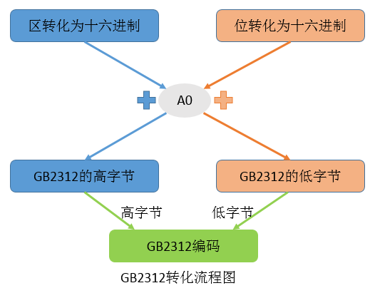
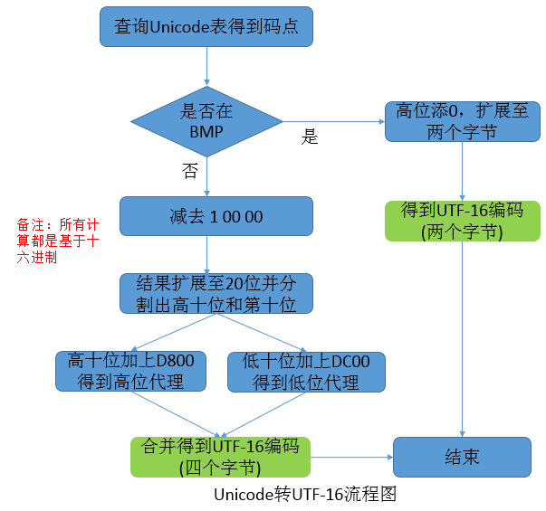

# 常见字符编码详解

## 一. 前言

　　在解决昨天的问题时，又引出了很多新的问题，如为什么要进行编码，这些编码的关系如何，如ASCII，IOS-8859-1，GB2312，GBK，Unicode之间的关系，笔者想要彻底理解字符编码背后的故事，遂进行了探索，具体笔记如下。如园友能读完本篇文章，我相信会解开很多疑惑。

## 二. 字符编码

### 2.1 为何需要字符编码

我们知道，所有的信息最终都表示为一个二进制的字符串，每一个二进制位（bit）有0和1两种状态。当我们需要把字符'A'存入计算机时，应该对应哪种状态呢，存储时，我们可以将字符'A'用01000010（这个随便编的）二进制字符串表示，存入计算机；读取时，再将01000010还原成字符'A'。那么问题来了，存储时，字符'A'应该对应哪一串二进制数呢，是01000010？或者是10000000 11110101？说白了，就是需要一个规则。这个规则可以将字符映射到唯一一种状态(二进制字符串)，这就是编码。而最早出现的编码规则就是ASCII编码，在ASCII编码规则中，字符'A'既不对应01000010，也不对应1000 0000 11110101，而是对应01000001（不要问为什么，这是规则）。


### 2.2 ASCII

这套编码规则是由美国定制，一共规定了128个字符的编码，比如空格"SPACE"是32（十进制）（二进制00100000），大写的字母A是65（二进制01000001）。这128个符号（包括 32个不能打印出来的控制符号），只占用了一个字节（8 bit）的后面7位，最前面的1位统一规定为0。总共才有128个字符编码，一个字节都没有用完，这好像似乎有点太少了。于是乎，就开始压榨最高位，对其为1时也进行编码，利用最高位进行编码的方式就称为非ASCII编码，如ISO-8859-1编码。


### 2.3 ISO-8859-1

这套编码规则由ISO组织制定。是在 ASCII 码基础上又制定了一些标准用来扩展ASCII编码，即 00000000（0） ~ 01111111（127） 与ASCII的编码一样，对 10000000（128） ~ 11111111（255）这一段进行了编码，如将字符§编码成 10100111（167）。ISO-8859-1编码也是单字节编码，最多能够表示256个字符。Latin1是ISO-8859-1的别名，有些环境下写作Latin-1。但是，即使能够表示256个字符，对中文而言，还是太少了，一个字节肯定不够，必须用多个字节表示。但是，由于是单字节编码，和计算机最基础的表示单位一致，所以很多时候，仍旧使用 ISO8859-1编码来表示。而且在很多协议上，默认使用该编码。比如，虽然"中文"两个字不存在ISO8859-1编码，以GB2312编码为例，应该是D6D0 CEC4两个字符，使用ISO8859-1编码的时候则将它拆开为4个字节来表示：D6D0 CEC4（事实上，在进行存储的时候，也是以字节为单位进行处理）。而如果是UTF编码，则是6个字节e4 b8 ad e6 96 87。很明显，这种表示方法还需要以另一种编码为基础才能正确显示。而常见的中文编码方式有GB2312、BIG5、GBK。


### 2.4 GB2312

GB2312其对所收录字符进行了"分区"处理，共94个区，区从1（十进制）开始，一直到94（十进制），每区含有94个位，位从1（十进制）开始，一直到94（十进制），共8836（94 * 94）个码位，这种表示方式也称为区位码，GB2312是双字节编码，其中高字节表示区，低字节表示位。各区具体说明如下：

```txt
01-09区收录除汉字外的682个字符，有164个空位（9 * 94 - 682）。
10-15区为空白区，没有使用。
16-55区收录3755个一级汉字（简体），按拼音排序。
56-87区收录3008个二级汉字（简体），按部首/笔画排序。
88-94区为空白区，没有使用。
```

那么根据区位码如何算出GBK2312编码呢？区位码的表示范围为0101 - 9494（包含了空的区位码）。[点击这里](http://www.qqxiuzi.cn/zh/hanzi-gb2312-bianma.php)，查看中GB2312编码区位码。之后只需要按照如下规则进行转化即可。

1. 将区（十进制）转化为十六进制。
2. 将转化的十六进制加上A0，得到GB2312编码的高字节。
3. 将位（十进制）转化为十六进制。
4. 将转化的十六进制加上A0，得到GB2312编码的低字节。
5. 组合区和位，区在高字节，位在低字节。
6. 得到GB2312编码。

　具体的流程图如下：



例如：'李'字的区位码为3278（表示在32区，78位）。1. 将32（区）转化为十六进制为20。2. 加上A0为C0。3. 将78（位）转化为十六进制为4E。4. 加上A0为EE。5. 组合区和位，为C0EE。6. 得到GB2312编码，即'李'字的GB2312编码为C0EE。

GB2312用两个字节编码，采用分区编码，总共编码的中文个数为6763（3755 + 3008）。这些汉字只是最常用的汉字，已经覆盖中国大陆99.75%的使用频率。但是，还有一些汉字在GB2312中没有被编码，如'镕'字，在GB2312中就没有被编码，这样就导致了问题，随之就出现了主流的GBK编码。在讲解GBK编码之前，我们另外讲解一下BIG5编码。


### 2.5 BIG5

BIG5采用双字节编码，使用两个字节来表示一个字符。高位字节使用了0x81-0xFE，低位字节使用了0x40-0x7E，及0xA1-0xFE。该编码是繁体中文字符集编码标准，共收录13060个中文字，其中有二字为重复编码，即“兀、兀”（A461及C94A)和“嗀、嗀”(DCD1及DDFC)。具体的分区如下：　　

```txt
8140-A0FE 保留给使用者自定义字符（造字区）
A140-A3BF 标点符号、希腊字母及特殊符号。其中在A259-A261，收录了度量衡单位用字：兙兛兞兝兡兣嗧瓩糎。
A3C0-A3FE 保留。此区没有开放作造字区用。
A440-C67E 常用汉字，先按笔划再按部首排序。
C6A1-F9DC 其它汉字。
F9DD-F9FE 制表符。
```

[点击这里](http://www.qqxiuzi.cn/zh/hanzi-big5-bianma.php)，查看BIG5编码。注意，BIG5编码与GBK编码没有什么关系。


### 2.6 GBK

GBK编码扩展了GB2312，**完全兼容GB2312编码**（如'李'字的GBK、GB2312编码均为C0EE），但其不兼容BIG5编码（'長'字的BIG5编码为AAF8，GBK编码为E94C，'李'字的BIG5编码为A7F5 不等于C0EE），即如果使用GB2312编码，使用GBK解码是完全正常的，但是如果使用BIG5编码，使用GBK解码，会出现乱码。相比于GB2312编码，GBK编码了更多汉字，如'镕'字。GBK编码依然采用双字节编码方案，其编码范围：8140－FEFE，剔除xx7F码位，共23940个码位。能表示 21003 个汉字。[点击这里](http://www.qqxiuzi.cn/zh/hanzi-gbk-bianma.php)，查看GBK编码。[点击这里](http://www.qqxiuzi.cn/bianma/zifuji.php)，可以查询中文的其他编码。在GBK之后又出现了GB18030编码，但是没有形成主流，故不做介绍，至此，中文编码的问题已经讲解完成。那么问题又来了，大陆网民与在海峡两岸网民交流时，若都使用GBK编码，则没有问题，若一方使用GBK编码，一方使用BIG5编码，那么就会出现乱码问题，这是在海峡两岸网民交流，如果漂洋过海进行交流呢？那就更容易出现乱码问题，这时候我们可能想，要是有一套全世界都通用的编码就好了，不要担心，这样的编码确实是存在的，那就是Unicode。


### 2.7 Unicode

有两个独立的, 创立单一字符集的尝试. 一个是国际标准化组织(ISO)的 ISO 10646 项目, 另一个是由多语言软件制造商组成的协会组织的 Unicode 项目. 在1991年前后, 两个项目的参与者都认识到, 世界不需要两个不同的单一字符集. 它们合并双方的工作成果, 并为创立一个单一编码表而协同工作. 两个项目仍都存在并独立地公布各自的标准, 但 Unicode 协会和 ISO/IEC JTC1/SC2 都同意保持 Unicode 和 ISO 10646 标准的码表兼容, 并紧密地共同调整任何未来的扩展。

Unicode是指一张表，里面包含了可能出现的所有字符，每个字符对应一个数字，这个数字称为码点(Code Point)，如字符'H'的码点为72（十进制），字符'李'的码点为26446（十进制）。Unicode表包含了1114112个码点，即从000000（十六进制） - 10FFFF（十六进制）。地球上所有字符都可以在Unicode表中找到对应的唯一码点。[点击这里](http://unicode-table.com/cn/)，查询字符对应的码点。Unicode将码空间划分为17个平面，从00 - 10（十六进制，最高两位），即从0 - 16（十进制），每个平面有65536个码点（2^16），其中**最重要的是第一个Unicode平面(码位从0000 - FFFF)，包含了最常用的字符，该平面被称为基本多语言平面（Basic Multilingual Plane），缩写为BMP，其他平面称为辅助平面(Supplementary Planes)**，在基本多文种平面內， 从D800到DFFF之间的码位区段是永久保留不映射到字符的， 因此UTF-16编码巧妙的利用了这保留下来的码位来对辅助平面内的字符进行编码，这点后面进行讲解。Unicode只是一个符号集，只规定的字符所对应的码点，并没有指定如何存储，如何进行存储出现了不同的编码方案，关于Unicode编码方案主要有两条主线：UCS和UTF。UTF主线由Unicode Consortium进行维护管理，UCS主线由ISO/IEC进行维护管理。

简单来说Unicode码表的最大值是0X10FFFF，也就是三个字节，但是BMP平面中包含着最常用的字符，它的最大值是0XFFFF，也就只需要占用两个字节。在Java语言中char类型只占用两个字节，**char中存储的是字符的Unicode码点，char只能表示 BMP子符。**


### 2.8 UCS

UCS全称为"Universal Character Set"，在UCS中主要有UCS-2和UCS-4

#### 2.8.1 UCS-2

UCS-2是定长字节的，固定使用2个字节进行编码，从0000（十六进制）- FFFF（十六进制）的码位范围，对应第一个Unicode平面。采用BOM(Byte Order Mark)机制，该机制作用如下：1. 确定字节流采用的是大端序还是小端序。2. 确定字节流的Unicode编码方案。

#### 2.8.2 UCS-4

UCS-4是定长字节的，固定使用4个字节进行编码。也采用了BOM机制。


### 2.9 UTF

UTF全称为"Unicode Transformation Format"，在UTF中主要有UTF-8，UTF-16和UTF-32。

#### 2.9.1 UTF-8

UTF-8是一种变长编码方式，使用1-4个字节进行编码。UTF-8完全兼容ASCII，对于ASCII中的字符，UTF-8采用的编码值跟ASCII完全一致。UTF-8是Unicode一种具体的编码实现。UTF-8是在互联网上使用最广的一种Unicode的编码规则，因为这种编码有利于节约网络流量（因为变长编码，而非统一长度编码）。关于Unicode码点如何转化为UTF-8编码，可以参照如下规则：

① 对于单字节的符号，字节的第一位设为0，后面7位为这个符号的unicode码。因此对于英语字母，UTF-8编码和ASCII码是相同的。

② 对于n字节的符号（n>1），第一个字节的前n位都设为1，第n+1位设为0，后面字节的前两位一律设为10。剩下的没有提及的二进制位，全部为这个符号的unicode码。

总结的编码规则如下：

```txt
U+  0000 ~ U+  007F: 0XXXXXXX 
00000000 00000000 ~ 00000000 01111111 #二进制范围
0 ~ 127 #十进制范围

U+  0080 ~ U+  07FF: 110XXXXX 10XXXXXX
00000000 10000000 ~ 00000111 11111111
128 ~ 2047

U+  0800 ~ U+  FFFF: 1110XXXX 10XXXXXX 10XXXXXX
00001000 00000000 ~ 11111111 11111111
2048 ~ 65535

U+ 10000 ~ U+10FFFF: 11110XXX 10XXXXXX 10XXXXXX 10XXXXXX
00000000 00000001 00000000 00000000 ~ 00000000 00010000 11111111 11111111
65536 ~ 1114111
```

说明：字符'A'的Unicode码点为65（十进制），根据上表，在第一行范围，则字符'A'的UTF-8编码为01000001，中文字符'李'的Unicode码点为26446（十进制），二进制为01100111 01001110，十六进制为674E。根据上表，在第三行范围，则将'李'二进制代码从低位到高位依次填入x中，不足的填入0。得到UTF-8编码为11100110 10011101 10001110，即E69D8E（十六进制）。

由上述编码规则可知，0000 0000 - 0000 FFFF（第一部分到第三部分）为Unicode第一个平面（基本多语言平面），而0001 0000 - 10 FFFF（第四部分）为Unicode其他平面（辅助平面）。在基本多语言平面对应了绝大多数常用的字符。对于大于65535（十进制）的码点，即在辅助平面上的码点，需要使用4个字节来进行UTF-8编码。

#### 2.9.2 UTF-16

UTF-8是不定长的编码，使用1、2、3、4个字节编码，而UTF-16则只使用2或4个字节编码。**UTF-16也是Unicode一种具体的编码实现**。关于Unicode如何转化为UTF-16编码规则如下：

① 若Unicode码点在第一平面（BPM）中，则使用2个字节进行编码。

② 若Unicode码点在其他平面（辅助平面），则使用4个字节进行编码。

关于辅助平面的码点编码更详细解析如下：辅助平面码点被编码为一对16比特（四个字节）长的码元, 称之为代理对(surrogate pair), 第一部分称为高位代理(high surrogate)或前导代理(lead surrogates)，码位范围为：D800-DBFF. 第二部分称为低位代理(low surrogate)或后尾代理(trail surrogates)， 码位范围为：DC00-DFFF。注意，高位代理的码位从D800到DBFF，而低位代理的码位从DC00到DFFF，总共恰好为D800-DFFF，这部分码点在第一平面内是保留的，不映射到任何字符，所以UTF-16编码巧妙的利用了这点来进行码点在辅助平面内的4字节编码。

说明：字符'A'的Unicode码点为65（十进制），十六进制表示为41，在第一平面。根据规则，UTF-16采用2个字节进行编码。那么问题又来了，知道了采用两个字节编码，并且我们也知道计算机是以字节为单位进行存储，这两个字节应该表示为00 41(十六进制)？或者是41 00（十六进制）呢？这就引出了一个问题，需要用到之前提及的BOM机制来解决。

表示为00 41意味着采用了大端序（Big endian），而表示为41 00意味着采用了小端序。那么计算机如何知道存储的字符信息采用了大端序还是小端虚呢？这就需要加入一些控制信息，具体是采用大端序，则在文件前加入FE FF，采用小端序，则在文件前加入FF FE。这样，当计算开始读取时发现前两个字节为FE FF，就表示之后的信息采用的是小端序，反之，则是大端序。

字符 （无法显示，只能截图显示），其Unicode码点为65902（十进制），十六进制为1016E，很显然，已经超出了第一平面（BMP）所能表示的范围。其在辅助平面内，根据规则，UTF-16采用4个字节进行编码。然而其编码不是简单扩展为4个字节（00 01 01 6E），而是采用如下规则进行计算。

1. 使用Unicode码位减去100000（十六进制），得到的值扩展20位（因为Unicode最大为10 FF FF（十六进制），减去1 00 00（十六进制）后，得到的结果最大为0FFF FF（十六进制），即为20位，不足20位的，在高位加一个0，扩展至20位即可）。

2. 将步骤一得到的20位，按照高十位和低十位进行分割。

3. 将步骤二的高十位扩展至2个字节，再加上D800（十六进制），得到高位代理或前导代理。取值范围是D800 - 0xDBFF。

4. 将步骤二的低十位扩展至2个字节，再加上DC00（十六进制），得到低位代理或后尾代理。取值范围是DC00 - 0xDFFF。

Unicode转UTF-16规则流程图如下：



按照这个规则，我们计算字符的UTF-16编码，我们知道其码点为1016E，减去10000得到016E，扩展至0016E，进行分割，得到高十位为00 0000 0000，十六进制为0000，加上D800为D800；得到低十位为01 0110 1110，十六进制为016E，加上DC00为DD6E；综合得到D8 00 DD 6E。即UTF-16编码为D8 00 DD 6E（也可为D8 0 DD 6E）。

而对于UTF-32是使用4个字节表示，也采用BOM机制，可以类比UTF-16，这里不再额外介绍。

## 三. 字符编码区别

### 3.1 UCS-2 与 UTF-16区别

从上面的分析知道，UCS-2采用的两个字节进行编码。在0000到FFFF的码位范围内，它和UTF-16基本一致，为什么说基本一致，因为在UTF-16中从U+D800到U+DFFF的码位不对应于任何字符，而在使用UCS-2的时代，U+D800到U+DFFF内的值被占用。

UCS-2只能表示BMP内的码点（只采用2个字节），而UTF-16可以表示辅助平面内的码点（采用4个字节）。

我们可以抽象的认为UTF-16可看成是UCS-2的父集。在没有辅助平面字符（surrogate code points）前，UTF-16与UCS-2所指的意思基本一致。但当引入辅助平面字符后，想要表示辅助平面字符时，就只能用UTF-16编码了。

### 3.2 UCS -4与 UTF-16的区别

在BMP上，UTF-16采用2个字节表示，而在辅助平面上，UTF-16采用的是4个字节表示。对于UCS-4，不管在哪个平面都采用的是四个字节表示。

### 3.3 为什么UTF-8编码不需要BOM机制

因为在UTF-8编码中，其自身已经带了控制信息，如1110xxxx 10xxxxxx 10xxxxxx 10xxxxxx，其中1110就起到了控制作用，所以不需要额外的BOM机制。


本文参考至：

<https://www.cnblogs.com/leesf456/p/5317574.html>

<https://www.cnblogs.com/lshao/p/11429429.html>

<https://www.zhihu.com/question/23374078/answer/24385963>