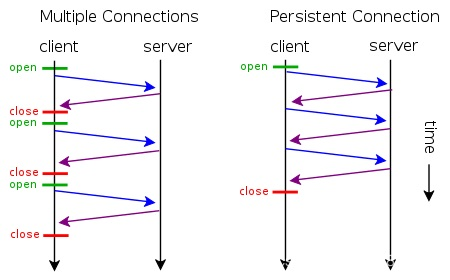

# HTTP协议中连接复用机制

在http请求时，我们一般会在request header 或 response header 中看到”Connection:Keep-Alive”或 “Connection:close”，这里具体的含义是有关http 请求的是否保持长连接，即链接是否复用，每次请求是复用已建立好的请求，还是重新建立一个新的请求。

```shell
GET http://www.tianjindong.cn/article/news/37.html HTTP/1.1
Host: www.tianjindong.cn
Connection: keep-alive
Upgrade-Insecure-Requests: 1
User-Agent: Mozilla/5.0 (Windows NT 10.0; Win64; x64) AppleWebKit/537.36 (KHTML, like Gecko) Chrome/79.0.3945.130 Safari/537.36 Edg/79.0.309.71
Accept: text/html,application/xhtml+xml,application/xml;q=0.9,image/webp,image/apng,*/*;q=0.8,application/signed-exchange;v=b3;q=0.9
Referer: http://www.tianjindong.cn/
Accept-Encoding: gzip, deflate
Accept-Language: zh-CN,zh;q=0.9,en;q=0.8,en-GB;q=0.7,en-US;q=0.6
Cookie: requestUrl=/index.html; JSESSIONID=7BBF114FE94F3EB12C4AD1A36658CA0D

```

而在实际生产环境中，可能会受到ECS/VM 的连接数限制而会对该配置项进行选择调配。例如VM规格只能支持65535个链接，如果链接不复用，都是短连接的话，并发过高的情况下，会直接把VM的连接数打满导致出现问题等，下面来详细说明下这个配置项。

## 基本释义

Connection 头（header） 决定当前的事务完成后，是否会关闭网络连接。如果该值是“keep-alive”，网络连接就是持久的，不会关闭，使得对同一个服务器的请求可以继续在该连接上完成。
更加官方的说明可见：RFC 2616<https://tools.ietf.org/html/rfc2616#section-8>

## 详细说明

HTTP协议采用“请求-应答”模式，当使用普通模式，即非KeepAlive模式时，每个请求/应答客户和服务器都要新建一个连接，完成之后立即断开连接（HTTP协议为无连接的协议）；当使用Keep-Alive模式（又称持久连接、连接重用）时，Keep-Alive功能使客户端到服务器端的连接持续有效，当出现对服务器的后继请求时，Keep-Alive功能避免了建立或者重新建立连接。

- 短连接
  所谓短连接，就是每次请求一个资源就建立连接，请求完成后连接立马关闭。每次请求都经过“创建tcp连接->请求资源->响应资源->释放连接”这样的过程
- 长连接
  所谓长连接(persistent connection)，就是只建立一次连接，多次资源请求都复用该连接，完成后关闭。要请求一个页面上的十张图，只需要建立一次tcp连接，然后依次请求十张图，等待资源响应，释放连接。
- 并行连接
  所谓并行连接(multiple connections)，其实就是并发的短连接。



**具体client和server要从短连接到长连接最简单演变需要做如下改进**：

第一步：client发出的HTTP请求头需要增加Connection:keep-alive字段

第二步：Web-Server端要能识别Connection:keep-alive字段，并且在http的response里指定Connection:keep-alive字段，告诉client，我能提供keep-alive服务，并且”应允"client我暂时不会关闭socket连接

在HTTP/1.0里，为了实现client到web-server能支持长连接，必须在HTTP请求头里显示指定

```shell
Connection:keep-alive
```

在HTTP/1.1里，就默认是开启了keep-alive，要关闭keep-alive需要在HTTP请求头里显示指定

```shell
Connection:close
```

在大多数浏览器都默认是使用HTTP/1.1，所以keep-alive都是默认打开的。一旦client和server达成协议，那么长连接就建立好了。

在http1.1中request和reponse header中都有可能出现一个connection头字段，此header的含义是当client和server通信时对于长链接如何进行处理。

在http1.1中，client和server都是默认对方支持长链接的， 如果client使用http1.1协议，但又不希望使用长链接，则需要在header中指明connection的值为close；如果server方也不想支持长链接，则在response中也需要明确说明connection的值为close。

不论request还是response的header中包含了值为close的connection，都表明当前正在使用的tcp链接在请求处理完毕后会被断掉。以后client再进行新的请求时就必须创建新的tcp链接了。 HTTP Connection的 close设置允许客户端或服务器中任何一方关闭底层的连接双方都会要求在处理请求后关闭它们的TCP连接。

**本文转载至**：<https://blog.csdn.net/LL845876425/article/details/89743593>