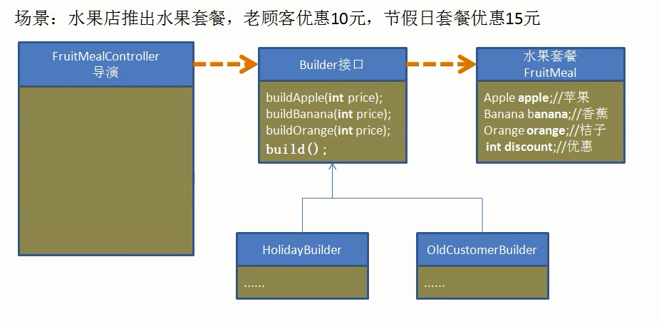

# 建造者模式

建造者模式（Builder Pattern）使用多个简单的对象一步一步构建成一个复杂的对象。这种类型的设计模式属于创建型模式，它提供了一种创建对象的最佳方式。

## 一. 什么是建造者模式

假如现在我们的水果店需要推出节日套餐，每个套餐包含若干价钱的苹果、桔子、香蕉，不同的套餐会有不同价格的优惠，我们如何才能灵活的完成这一任务呢？



首先我们准备苹果、桔子、香蕉，他们包含各自的价格：

```java
public class Apple implements Fruit {
    private int price = 100;
    public Apple(){}
    public Apple(int price){
        this.price = price;
    }
}
```

....

我们将套餐抽象为一个类：

```java
public class FruitMeal {

    private Apple apple;//苹果--价格
    private Banana banana;//香蕉价格
    private Orange orange;    //桔子价格
    private int discount;//折扣价

    private int totalPrice;//套餐总价

    //省略Setter方法...

    public void init() {
        if (null != apple){
            totalPrice += apple.price();
        }
        if (null != orange){
            totalPrice += orange.price();
        }
        if (null != banana){
            totalPrice += banana.price();
        }
        if (totalPrice > 0){
            totalPrice -= discount;
        }
    }

    public void showItems() {
        System.out.println("totalPrice：" + totalPrice);
    }
}
```

建造者接口：

```java
public interface Builder {//也是工厂

    Builder buildApple(int price);//设置苹果
    Builder buildBanana(int price);//设置香蕉
    Builder buildOrange(int price);//设置桔子

    FruitMeal build();//返回创建的套餐
}
```

建造者实例：

```java
//假期套餐建造者
public class HolidayBuilder implements Builder {
    private FruitMeal fruitMeal = new FruitMeal();

    @Override
    public HolidayBuilder buildApple(int price) {
        Apple apple = new Apple();
        apple.setPrice(price);
        fruitMeal.setApple(apple);
    }

    @Override
    public HolidayBuilder buildBanana(int price) {
        Banana fruit = new Banana();
        fruit.setPrice(price);
        fruitMeal.setBanana(fruit);
    }

    @Override
    public HolidayBuilder buildOrange(int price) {
        Orange fruit = new Orange();
        fruit.setPrice(price);
        fruitMeal.setOrange(fruit);
    }

    @Override
    public FruitMeal build() {
        fruitMeal.setDiscount(15);//折扣价格对一个套餐来，是固定的
        fruitMeal.init();
        return fruitMeal;
    }
}
```

```java
//老顾客套餐
public class OldCustomerBuilder implements Builder {
    private FruitMeal fruitMeal = new FruitMeal();

    @Override
    public OldCustomerBuilder buildApple(int price) {
        Apple apple = new Apple();
        apple.setPrice(price);
        fruitMeal.setApple(apple);
    }

    @Override
    public OldCustomerBuilder buildBanana(int price) {
        Banana fruit = new Banana();
        fruit.setPrice(price);
        fruitMeal.setBanana(fruit);
    }

    @Override
    public OldCustomerBuilder buildOrange(int price) {
        Orange fruit = new Orange();
        fruit.setPrice(price);
        fruitMeal.setOrange(fruit);
    }

    @Override
    public FruitMeal build() {
        fruitMeal.setDiscount(10);//老顾客优惠10元
        fruitMeal.init();
        return fruitMeal;
    }
}
```

建造者模式中需要一个“导演”类，来达到不同的建造效果：

```java
public class FruitMealController {//收银台---导演类

    public void construct() {
//      Builder builder = new HolidayBuilder();
        Builder builder = new OldCustomerBuilder();//spring注入方法，
        
        //以下代码模板，轻易是不变的
        builder.buildApple(120)//创建苹果设置价格
                 .buildBanana(80)//创建香蕉设置香蕉价格
                 .buildOrange(50);//创建桔子设置价格
        
        FruitMeal fruitMeal = builder.build();
        int cost = fruitMeal.cost();
        System.out.println("本套件花费："+cost);
    }
    public static void main(String[] args) {
        new FruitMealController().construct();
    }
}
```

## 二. 建造者模式的结构

- **Builder**：给出一个抽象接口，以规范产品对象的各个组成成分的建造。这个接口规定要实现复杂对象的哪些部分的创建，并不涉及具体的对象部件的创建；
- **ConcreteBuilder**：实现Builder接口，针对不同的商业逻辑，具体化复杂对象的各部分的创建。 在建造过程完成后，提供产品的实例；
- **Director**：调用具体建造者来创建复杂对象的各个部分，在指导者中不涉及具体产品的信息，只负责保证对象各部分完整创建或按某种顺序创建；
- **Product：**要创建的复杂对象

## 三. 建造者模式与工厂模式的区别

### 3.1 对象复杂度

**建造者模式**：建造者模式建造的对象更加复杂，是一个符合产品，它由各个部件复合而成，部件不同产品对象不同，生成的产品粒度细。

**工厂方法模式**：在工厂方法模式中，我们关注的是一个产品的整体，无须关注产品各部分是如何创建出来的。


### 3.2 客户端参与程度

**建造者模式**：导演对象参与了对象的创建，决定了产品的类型和内容，参与度高；适合实例化对象时属性变化频繁的场景。

**工厂模式**：客户端对产品的创建过程参与度低，对象实例化时属性值相对固定。