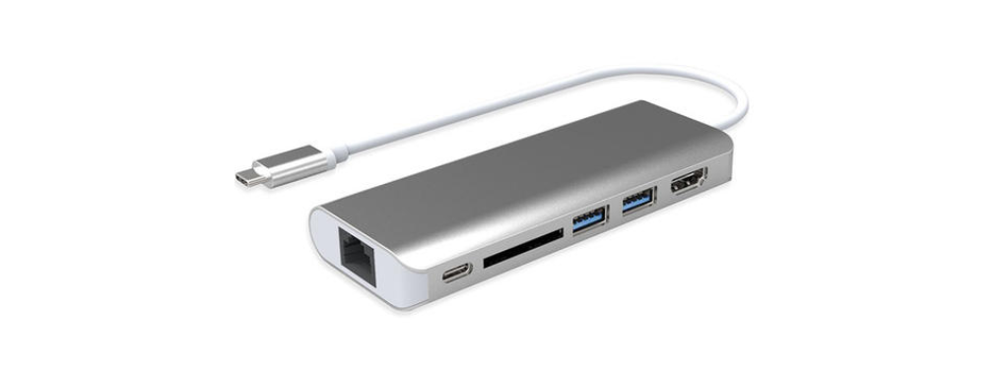
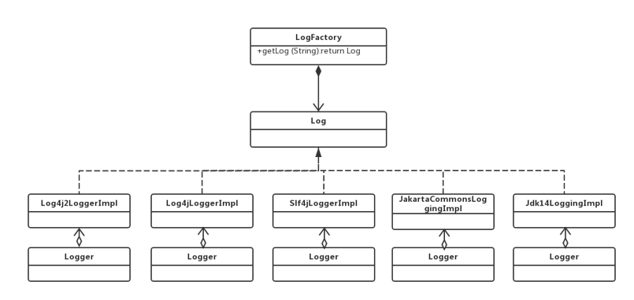

# 适配器模式

适配器模式（Adapter Pattern）是作为两个不兼容的接口之间的桥梁，将一个类的接口转换成客户希望的另外一个接口。适配器模式使得原本由于接口不兼容而不能一起工作的那些类可以一起工作；



现在的轻薄笔记本有很多都采用Type-C接口，取消了传统的USB接口，那么传统设备与其连接就需要适配器做一个桥梁，将其他接口转换成笔记能够使用的Type-C。

## 适配器模式中有三个角色

- Target：目标角色,期待得到的接口。
- Adaptee：适配者角色,被适配的接口。
- Adapter：适配器角色,将源接口转换成目标接口。


## MyBatis适配器模式的体现

在代码世界中适配器模式也经常使用，我们就拿MyBatis日志模块来说，MyBatis并没有提供日志的实现类，需要第三方日志组件，但是第三方的日志组件都有自己的Log级别，且各不相同，而MyBatis通过Log接口将第三方日志统一为：trace、debug、warn、error四个级别。



在上图中Log接口就是我们提到的目标角色，Log4j2LoggerImpl、Log4jLoggerImpl、Slf4jLoggerImpl...都是各自日志组件的适配器。

我们就以Log4j日志组件的适配器为例：

```java
public class Log4jImpl implements Log {
  
  private static final String FQCN = Log4jImpl.class.getName();

  private Logger log;

  public Log4jImpl(String clazz) {
    log = Logger.getLogger(clazz);
  }

  @Override
  public boolean isDebugEnabled() {
    return log.isDebugEnabled();
  }

  @Override
  public boolean isTraceEnabled() {
    return log.isTraceEnabled();
  }

  @Override
  public void error(String s, Throwable e) {
    log.log(FQCN, Level.ERROR, s, e);
  }

  @Override
  public void error(String s) {
    log.log(FQCN, Level.ERROR, s, null);
  }

  @Override
  public void debug(String s) {
    log.log(FQCN, Level.DEBUG, s, null);
  }

  @Override
  public void trace(String s) {
    log.log(FQCN, Level.TRACE, s, null);
  }

  @Override
  public void warn(String s) {
    log.log(FQCN, Level.WARN, s, null);
  }
}
```

