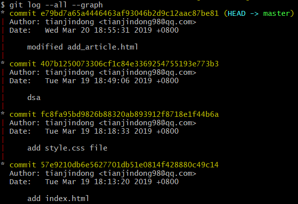

## 通过`log`命令查看版本演变历史

​	在提交了若干更新，又或者克隆了某个项目之后，你也许想回顾下提交历史。 完成这个任务最简单而又有效的工具是 `git log` 命令。

### `log命令`参数

- 不带参数： `git log` 会按提交时间列出所有的更新，最近的更新排在最上面。 正如你所看到的，这个命令会列出每个提交的 SHA-1 校验和、作者的名字和电子邮件地址、提交时间以及提交说明。

```shell
$ git log
commit e79bd7a65a4446463af93046b2d9c12aac87be81 (HEAD -> master)
Author: tianjindong <tianjindong98@qq.com>
Date:   Wed Mar 20 18:55:31 2019 +0800

    modified add_article.html

........

```

- `--online`参数：用于显示简介的日志迭代信息。

  ```shell
  $ git log --oneline
  e79bd7a (HEAD -> master) modified add_article.html
  407b125 dsa
  fc8fa95 add style.css file
  57e9210 add index.html
  ```

- `-n`参数：n代表一个整数，表示列出最近n条日志信息

  ```shell
  $ git log -2
  $ git log --oneline -5
  ```

- `--all`参数：默认情况下只查看当前分支的版本演变历史，加上`--all`参数后就会列出所有分支的版本演变历史。

  ```shell
  $ git log --all -5
  ```

  

- `--graph`参数：在搭配`--all`参数显示版本演变历史时，由于很多分支在里面，无法看清分支间的关系，我们就可以使用`--graph`参数，进行图形化显示。

  

  注意：最左边竖着的红线连起来的版本演变历史，就是一个分支的演变历史。

- `-p`参数：用来显示每次提交的内容差异。


### 查看当前分支所有提交历史

```shell
git log <branch-name>
```

### 查看b分支相对于a分支到底做出了哪些修改

```shell
git log a..b
```

a..b用来表示来自于分支b，但不属于分支a的提交。这样就能清晰的看出分支b相对于分支a到底做出了哪些改变。

### **查看某个文件或某个目录的更新记录**

```shell
git log 文件名或目录名
```

